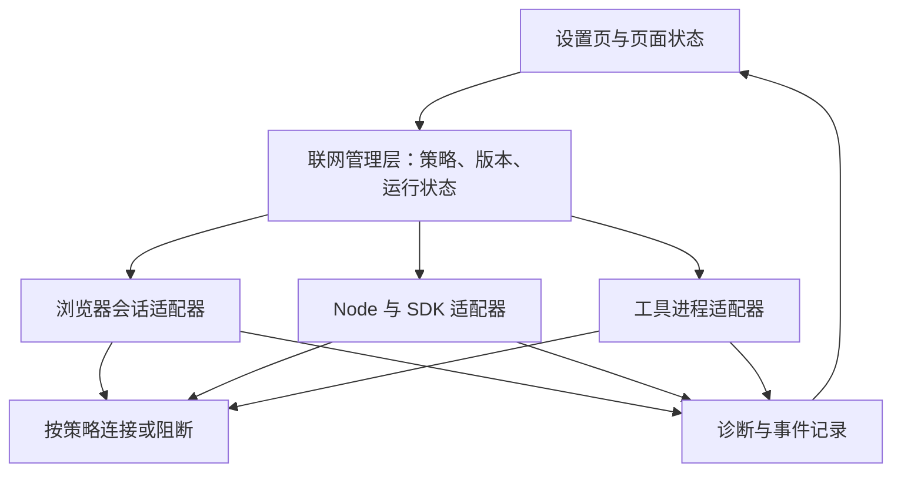

# onething Proxy 的长期形态与当前差距

2026-09-16。本文是基于当前实现与本机实验的设计建议，不表示这些能力已经实现。

长期目标应是：**用户为一组工作指定联网方式后，应用持续执行这项选择；遇到异常时按约定暂停，并能解释实际发生了什么。**

对需要代理的工作，核心承诺应是：“要么通过指定代理连接，要么明确停止连接。”这个承诺要覆盖启动、后台、切换配置、长连接、休眠恢复和异常恢复。设置页只是这项能力的入口。

我们目前已有正常路径上的代理能力，距离上述目标主要差在**失败时阻断、连接生命周期管理、跨网络实现的一致性，以及可核查的运行状态**。建议先把一个固定代理做到可信，再扩展规则和多个代理。

## 1. 用户最终应该得到什么

用户选择“使用指定代理”后，应当可以依赖以下行为：

| 用户遇到的情况 | 最终应有的体验 |
|---|---|
| 第一次开启代理 | 显示“正在应用”，受影响的联网暂缓；应用成功后恢复。配置错误明确提示，不暗中转直连 |
| 切换代理 | 告知哪些页面或任务需要重连；旧路线的连接停止后才宣布切换完成 |
| 代理挂了 | 显示“代理不可用，连接已暂停”，提供重试和检查设置；恢复过程可见 |
| 应用在后台 | 仍然遵守同一条联网规则；后台是否暂停网页是独立的省电/任务设置 |
| 合盖后重新打开 | 显示恢复状态，检查配置是否仍有效；不能靠“等几秒大概好了”放行 |
| 某个网页连不上 | 区分代理不可达、认证失败、目标网站拒绝、应用配置失败；不把所有错误都叫“网络错误” |
| 想知道流量去哪了 | 能查看该页面/任务采用的策略、明确的直连例外，以及最近一次诊断结果与时间 |

设置主界面保持简单：联网方式、代理地址、例外、当前状态、测试连接。认证信息和复杂规则放在需要时才展开的区域。

浏览器或任务附近也应能看到受影响的状态。只在设置页显示错误，用户执行工作时仍会误以为联网正常。

## 2. 必须分清两种承诺

**“应用连接到指定代理”不等于“目标网站看见指定国家、指定 IP”。** 比如应用连接到本机 Clash，但 Clash 的规则仍可能选择直连，或者在不同节点间切换。onething 的固定代理设置本身无法控制远端出口。

建议把能力分成两层：

- **基础保证：指定代理路径。** 对明确纳入管理的网络流量，禁止未经授权的直连；异常时阻断。这是我们应该首先承担的产品承诺。
- **可选能力：出口观测或出口约束。** 显示通过相同网络路径测得的出口地址、时间和目标；如要承诺出口固定，则还需控制或集成代理端路由。一个查询 IP 的探针不能证明所有域名都走相同出口，也不能保证探针之后出口不变。

同样，“不使用应用代理”只表示应用不使用显式代理；系统 VPN、TUN 或网络设备仍可能改变最终路线。产品文案需要说明这个范围。

代理也不能承诺第三方账号不被封禁。我们应承诺可控、可解释的连接行为，不应把未知的平台风控结果包装成代理功能。

## 3. 当前能力与差距

| 维度 | 当前已有 | 主要差距 | 优先级 |
|---|---|---|---|
| 设置交互 | 地址、绕过规则、校验、保存状态、失败重试、连接测试 | 配置保存、各网络组件应用成功、最近连接验证没有形成完整且一致的状态 | 第一阶段 |
| 浏览器代理 | 默认会话与浏览器分区接入策略；首个页面加载等待代理回放 | ready 在失败后也会完成，不能证明代理成功落地 | 第一阶段 |
| 代理掉线 | 本机固定 HTTP 代理实验中，HTTP/HTTPS/WS/WSS 失败，没有自动直连 | 必须把这一行为扩展成有边界、有回归测试的承诺，覆盖配置异常和切换过程 | 第一阶段 |
| 无效配置 | UI 有输入校验 | 底层启用状态下的无效 URL 会转为 direct | 第一阶段 |
| 配置应用失败 | 有错误回调 | 错误被吞掉，页面可以沿用原状态；原状态若是 direct 就存在直连风险 | 第一阶段 |
| 已有连接 | 新请求可使用新策略 | 实测旧直连 WSS 在开启代理后仍能发送；单次 closeAllConnections 未结束该连接 | 第一阶段 |
| 多种联网实现 | Chromium 和部分 Node 请求已有代理接入点 | 尚未证明浏览器、服务工作线程、SDK、下载、外部工具等所有相关路径的一致覆盖 | 第一阶段盘点，后续补齐 |
| 休眠、恢复、网络变化 | Chromium/系统本身有恢复行为 | 缺少应用统一协调和恢复状态；事件处理本身也不能替代持续生效的阻断能力 | 第二阶段 |
| 诊断 | 连接测试、部分日志、此次本地实验 | 无法还原某时刻某分区是否成功应用、旧连接是否仍存活；历史路由记录不足 | 第二阶段 |
| 多代理、按工作隔离 | 浏览器已有分区基础 | 暂无完整的每工作区策略、路由解释和统一能力边界 | 第三阶段，按需求投入 |

这些缺口有不同的证据强度：旧 WSS 和无效配置已实际复现；setProxy 失败处理采用了显式故障注入；其他未覆盖路径需要继续盘点，不能直接认定发生泄漏。详见[行为检查报告](/Users/yitiansong/data/code/start-electron/docs/audit/browser-sleep-proxy-behavior-2026-09-16.md)。

## 4. 架构上需要一个统一的联网管理层

建议让一个应用级组件拥有联网策略、状态与变更过程，各网络实现作为适配器接入。共享的是规则与结果，不要求 Chromium 和 Node 使用同一个网络库。

这里最重要的设计不是增加一个类，而是落实五项规则：

1. **策略有明确作用范围。** 一个页面、后台任务或工具进程必须能回答自己受哪项策略管理。未接入的工具不能显示为“已受保护”。
2. **期望配置和有效配置分开。** 保存成功只是记录了用户意图；每个适配器确认成功后，才更新相应范围的生效状态。
3. **变更带版本、按顺序执行。** 用户快速改两次地址时，旧操作的完成回调不能覆盖新状态。新建浏览器分区也要先加入当前策略，再允许联网。
4. **严格代理模式默认拒绝不确定状态。** 配置无效、应用失败、切换未完成时，阻断受影响范围。重试、探测请求也不能偷偷使用直连后备。
5. **例外是显式授权。** 本地服务和用户指定域名可以按规则直连，但应可查看、可解释；浏览器和 Node 对同一例外不能产生不同解释。

Electron 区分 direct、system、fixed_servers 等代理模式，跟随系统与明确直连是不同语义；产品不应再用一个含糊的开关表达二者。第一阶段保留简单的显式直连/指定代理即可，确有需求后再引入跟随系统，并说明系统策略可能选择直连。[Electron ProxyConfig](https://www.electronjs.org/docs/latest/api/structures/proxy-config)

## 5. 切换与恢复应是有完成条件的过程

一次代理变更建议按以下顺序进行：

1. 校验待提交配置；无效草稿不影响仍在执行的旧有效配置，明确显示尚未应用。
2. 开始应用时，阻止受影响范围创建新业务连接。
3. 终止需要淘汰的旧连接；对于不能可靠终止的网络上下文，采用经过验证的重建方案。
4. 向相关适配器应用新策略，并收集带版本的结果。
5. 通过相同路径做有时限的必要检查，确认策略已落地；目标网站自身故障不能误判为全局代理故障。
6. 更新有效状态，恢复可安全恢复的请求。失败则保持该范围阻断，并显示原因。

若回退，也只能回到仍被用户允许的策略。用户从直连切到严格代理失败时，不能为了“回退成功”重新开放直连。

旧长连接是这里最难的部分之一。Electron 文档提醒切换代理时处理旧连接池，但我们的 Electron 41.1.1 实验中，closeAllConnections 后旧 WSS 仍能发送。因此完成条件应是“旧路线实际停止”，而不是“清理 API 已经返回”。[Electron Session](https://www.electronjs.org/docs/latest/api/session)

休眠通知只能帮助协调，不能作为唯一保护措施。应用可能来不及完成异步清理，也可能发生崩溃或网络进程重启；阻断策略需要在平时就成立。唤醒时利用已有电源事件重新检查并恢复，不能仅靠收到 resume 后才临时补救。[Electron powerMonitor](https://www.electronjs.org/docs/latest/api/power-monitor)

重连也不能等于重放全部操作。提交表单、付款、发消息等请求不能未经判断自动重试；网页重建可能丢失未提交输入，需要在产品交互中显式处理。登录态可以尽量保留，但不承诺所有网页内存状态都能无损恢复。

## 6. 状态需要反映用户真正关心的事实

内部至少区分三类信息，并由它们生成界面文案：

| 信息 | 示例 | 不能推导出的结论 |
|---|---|---|
| 配置是否保存 | 已保存代理地址 | 不代表所有页面已经应用 |
| 策略是否生效 | 浏览器分区正在切换 / 已应用 / 应用失败且已阻断 | 已应用不代表代理当前可达 |
| 最近连接观测 | 15:32 经浏览器路径测试成功；目标返回拒绝；代理认证失败 | 一次成功不保证未来持续可达，也不代表所有目标使用相同出口 |

常用文案可以是“正在应用代理”“正在检查连接”“代理已应用，最近测试成功”“代理不可用，连接已暂停”“部分工具尚未接入”。未知状态直接说明未知。

不要让一个绿色圆点同时代表保存成功、代理可达、网页正常、出口稳定。代理正常而 Claude 返回 403 时，应保留代理状态，单独呈现网站拒绝。

连接测试要从实际使用的路径发起：浏览器问题通过相应浏览器分区测试，Node 问题通过相应客户端测试。端口能连接、某个 SDK 请求成功，都不能单独证明浏览器分区正确。

诊断默认保存策略版本、作用范围、应用结果、错误类别和关键生命周期事件。不要采集 Cookie、令牌、认证密码或请求正文；完整网络日志应按需启用、限时保留、脱敏导出。代理凭据应使用受保护的存储，不能直接混入普通设置与日志。

## 7. 不能靠应用代理开关覆盖的范围

HTTP/HTTPS/WS/WSS 的正确性仍需逐项验证；DNS、WebRTC/UDP、服务工作线程、下载及外部工具进程也要有覆盖清单。设置环境变量或增加一次页面请求拦截，不足以证明任意工具和协议都受控。

若未来承诺升级为“任意插件、任意子进程、任意协议都不允许绕过”，执行边界也要升级到受控进程环境、网络隔离或系统级约束。那是更高一层的产品与工程投入。短期应清楚标出不受管范围，不能提前宣传全应用或全设备防泄漏。

同样，不建议现在就自建完整代理客户端和复杂节点系统。onething 先把自身可控的流量管好，通过稳定接口与现有代理服务协作；当固定出口、规则管理或受控工具成为明确需求，再决定是否扩大控制边界。

## 8. 建议的推进顺序与验收标准

| 阶段 | 交付重点 | 完成标准 |
|---|---|---|
| 第一阶段：代理承诺可信 | 无效配置不降级直连；应用失败可见且阻断；新分区有门禁；切换时处理旧连接；盘点联网入口 | 在受管范围内，启动竞态、setProxy 失败、快速连续修改、代理掉线、旧 WSS 等场景中，目标侧观察到的未经授权直连为 0；失败状态与实际阻断一致 |
| 第二阶段：生命周期与诊断完整 | 休眠/恢复、网络变化、进程重启；分路径诊断；有限历史事件；可靠重连交互 | 能解释某次失败处于哪一层；硬件休眠与异常恢复实测符合策略；不会因重连自动重复执行非幂等业务操作 |
| 第三阶段：扩展适用范围 | 按工作区绑定代理、认证与凭据管理、工具进程接入、出口观测；需要时增加系统级约束 | 每项新增能力都有明确覆盖范围、相同的失败语义和独立验收；不存在“界面显示受管，执行路径未接入”的情况 |

测试应同时运行本地目标服务器与代理服务器，观察请求实际从哪条路径到达；阻断场景下不仅断言报错，还要断言目标没有收到未经授权的请求。HTTP、HTTPS、SSE、WS、WSS 及相关后台行为分别覆盖。升级 Electron 时重跑，尤其是旧连接终止实验。

**下一步最值得做的是第一阶段：让“已开启代理”成为一个可验证的运行承诺。** 当前的配置、分区接入和 Node 代理能力可以保留，围绕它们补上状态、阻断与连接管理；无需从头重写，也不应先用更多规则和开关掩盖这几项核心缺口。
