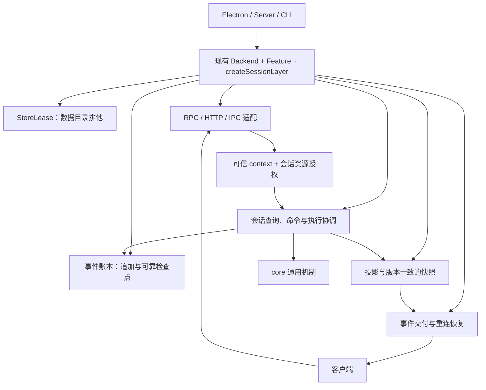

# 后端问题修复与架构调整方案

日期：2026-09-06  
状态：实施中。本文统一处理已确认的问题与维护扩展目标；逐项实施与验证状态见 [实施台账](backend-implementation-status-2026-09-06.md)。

## 1. 方案决策

**先建立可靠保存、独占写入和统一退出的基础，再集中会话业务入口，完成授权、断线恢复和依赖拆分。** 每个 bug 都要有行为验收；每次结构调整都要减少一种实际耦合。

沿用已有 Backend 组合根、`createSessionLayer`、Feature 名册、统一 RPC、runtime 能力接口和 Gateway 桥接。保持同进程单个活跃 Backend，并补齐“同一数据目录只允许一个写入进程”。

本轮的交付目标：

1. 保存失败能被调用方获知，关键外部动作前有可靠检查点。
2. Electron、Server、CLI 共用存储排他机制，正常退出完成收尾。
3. 会话操作统一检查资源归属；支持的客户端重连后恢复正确状态。
4. 消除选定会话链的循环依赖，新增能力主要修改所属模块。

本轮不更换账本格式，不引入微服务、全仓多实例、新 DI 框架或新的万能 SessionService。凭证签发、多 Principal 等平台工程继续留在本轮之外。

## 2. 问题与修复对应关系

> 2026-09-07 撤回：会话同步协议已整条删除（第二套真相），见 docs/audit/session-sync-retirement-2026-09-07.md

| 编号 | 当前问题及证据范围 | 本方案的处理 |
| --- | --- | --- |
| R1 | 同目录可能进入多个写入进程；锁元信息未写完时可被抢占，后者已有隔离复现 | 所有宿主共用 StoreLease，初始化存储前持有；锁损坏时拒绝抢占 |
| R2 | append 或 fsync 失败后 flush 仍正常返回，已有故障注入复现 | 明确检查点语义、保留首个失败、贯通上层错误处理 |
| R3 | 默认通配订阅不补断线期间事件，已有复现 | 新同步协议先恢复快照，再支持明确作用域的续播 |
| R4 | 通用命令未核验 owner/workspace，已用不同 context 复现跨 owner abort | 固定可信身份来源；在会话应用入口统一做资源授权 |
| R5 | Electron 信号退出直接 process.exit，源码确认绕过正常清理 | 窗口退出和信号共用有总时限的退出流程 |
| A1 | stores 与 Commands 相互导入并承担生产装配 | 把生产端口绑定移入现有会话装配层，迁走 store 的命令兼容入口 |
| A2 | Writer、Surface、Prepare 相互依赖，初始化顺序隐含 | 注入窄端口，由 createSessionLayer 统一安装观察者并登记释放 |
| A3 | shared 与 runtime 双向依赖，类型和实现再导出混用 | 明确类型归属，逐步移除 shared 对实现模块的反向引用 |
| A4 | RPC handler 同时做协议适配、生产接线和业务协调 | handler 调用已装配的用例，保留统一 registry 与 Feature 入口 |

R4 在互不信任用户共享服务时属于高优先级授权问题；目前统一 token 模型不能被当作已有多用户身份隔离系统。R1/R5 的全部真实宿主场景尚未做集成复现，本方案列出相应验收。

命令提前返回 `success` 可以表示“已接收”，不是独立 bug。问题在于不能把它当成执行完成或可靠保存的证明。

## 3. 目标架构与职责

图中是职责与主要调用关系，Root 负责创建和连接它们。Journal 与 Views 不应互相导入来启动自己；同步观察者、恢复流程和事件交付由装配层显式绑定。

| 位置 | 目标职责 |
| --- | --- |
| `apps/*` | 进程启动、宿主能力、信号接入；委托统一装配和退出入口 |
| `packages/backend` | 组合根、会话接线、资源所有权、协议及宿主适配 |
| `packages/onething-runtime` | 产品用例、策略、能力接口及已有存储/SDK 实现 |
| `packages/core` | 通用执行、事件与投影机制、已有内核契约；保持宿主和产品依赖禁令 |
| `packages/shared` | 共享请求、响应和事件契约；不作为后端实现的入口 |
| `packages/client` | 统一调用、状态同步、订阅恢复 |
| `packages/gateway` | Channel 与 CoreConversationRuntime 桥接；沿用现有注入方式 |

先在原目录明确依赖和责任，再将纯产品用例移入对应 runtime 模块。不要在同一个提交里同时做大规模移动、业务改动和接口改名。

## 4. 五类问题的具体修复设计

### 4.1 R2：可靠保存与错误传播

保留现有同步 append 的使用方式，明确它返回的序号只是“已接受、已进入内存/队列”。提供可等待的检查点，概念签名为 `flush(sessionId, throughSeq)`；实际命名优先兼容现有函数。

| 状态 | 含义 |
| --- | --- |
| accepted | 事件已接受，不能据此承诺磁盘保存 |
| durable | 指定序号之前的追加全部成功，且 fsync 完成 |
| failed | 对应写入或刷盘失败，本次检查点必须拒绝成功返回 |

实现要求：

1. 调用检查点时固定目标序号/队列水位，不因后来不断追加而无限等待。未来序号等非法目标应明确拒绝。append 必须先建立序号与真实写入完成 Promise 的绑定，再向观察者公布该序号；观察者重入 flush 时不能捕获一条尚未包含目标事件的旧队列。
2. 异步写队列保留首个错误及关联会话、序号。内部 catch 可用于收尾，但不能把队列恢复为“全部成功”的假象。检查点按目标水位判断：目标之前的失败必须传播；更晚的失败不能倒写已有持久化水位，也不能被此前检查点的成功掩盖。
3. 检查点等待对应写入后检查失败，并传播 append、open、fsync 的真实错误。首次创建还必须持久化新文件及所需父目录的目录项；平台能力需显式验证，目录同步失败同样阻止外部动作。有待保存事件时 ENOENT 同样是失败；确实没有创建账本且无待写事件的空 flush 可正常返回。
4. 失败后拒绝该会话继续追加及触发新的外部动作；读取与诊断仍可用。不要清空失败标记后直接继续写，更不能靠后续成功掩盖中间缺口。
5. 保留现场，通过独立错误通道告知“保存失败”。错误报告不能依赖正在失败的同一账本。恢复写入需要显式检查文件和投影一致性，不能静默重试有外部副作用的命令。

6. 目标水位引用的附件、图片与大工具结果也是检查点依赖。先验证并持久化 blob 内容与新增目录，再完成引用事件检查点；JSONL 可读不能代替正文完整的验收。
7. Windows 是既有支持平台，B1 必须提供原生保存成功路径和真实平台测试。Windows 的文件/元数据保存与 POSIX 目录同步分别实现并明确文件系统范围；临时 ENOTSUP 或跳过成功用例不算交付。进程重启验证不能替代断电证明。

**检查点要贯通执行协调层。** 模型请求、工具执行等关键外部动作前，先记录对应意图并等待检查点；失败时本次调用次数应为零。当前 recorder 的 `void flush` 应调整，但真正的等待应放在执行协调入口，不能只依赖一个异步总线订阅者。run 收尾也必须上报保存失败。

执行器逐项列出能力：本地引擎、直接工具、Claude Code SDK、ACP。外部执行器必须提供可等待的动作前接口；审批回调和事后通知不自动满足要求。SDK hook 超时/失败不能被外部执行器忽略后继续动作。无法提供逐动作屏障的协议列为待解决的明确交付缺口，不能通过禁用已有功能或降低完成声明来掩盖。

普通流式片段仍可批量追加，避免每个 token 都 fsync。先测正常请求的检查点耗时与队列积压，再确定批量参数，不预先承诺无性能成本。

旧 RPC 成功信封保持“已接收”的含义；执行结束和保存状态通过明确结果/事件表达，沿用已有请求关联字段。外部动作已发生但结果保存失败时，应标记为“结果未可靠保存”，不能承诺跨崩溃的 exactly-once，也不能自动重放该动作。

### 4.2 R1：所有宿主共用 StoreLease

在已有 `StoreLock` 的实现边界演进一个 StoreLease 接口，供 Backend 装配统一使用，不再让各宿主自行判断是否可以写。

- 对已解析、规范化的真实 store 路径取得 lease，再初始化 repository、缓存、恢复器和后台任务。
- 同一物理目录通过不同路径或符号链接访问，也应进入同一个锁位置。
- Electron、Server、CLI 的自有 Backend 都走同一入口；HTTP 借用现有 Backend 时不重复申请。
- 发现文件和端口探活只用于连接发现，不能代替排他锁；`--force` 不允许绕过写入排他。
- 后台恢复、索引修复等写任务也必须运行在持有 lease 的 Backend 下；独立修复工具使用同一排他入口。
- 启动时遗留 socket、PID 和发现文件的探测清理也属于此边界；未取得 lease 的进程不能通过迟到异步回调删除胜出者的入口。

**第一版采用保守排他目录锁。** 本地检索没有发现现成的 OS 文件锁适配，不能假定已有跨平台 flock/LockFileEx 能力。

1. 用同一锁路径的原子目录创建竞争所有权，仅创建成功者进入写入阶段。
2. 创建后写入 PID、启动时间、随机 nonce 和协议版本。目录存在时其他进程一律拒绝，即使元信息为空、损坏或仍在初始化。
3. 不用 TTL 抢占；不以“读不到 PID”作为删除理由。正常释放只由本 lease 持有者执行，写入停止后核对身份并清理。
4. 第一版不做在线自动回收旧锁。“读 nonce/PID → unlink”仍有竞争窗口，不能被宣传成安全自动恢复。

**崩溃恢复与代价：** 第一版异常退出会留下锁，恢复流程要求停止全部相关宿主并禁止自动重启，核对旧进程已退出，确认目录身份后将旧锁隔离到唯一诊断位置，再重启。身份不明、PID 复用或无法确认停机时拒绝清理。恢复工具默认只诊断，不支持运行中强抢。

这会牺牲无人值守的自动恢复能力。若发布要求崩溃后全自动重启，则跨平台 OS 持锁句柄适配及其验证必须纳入本轮 R1 的发布前置条件，不能交付目录锁版本后再宣称满足该要求。第一版的排他保证以经验证的本地文件系统和已升级宿主为范围，网络共享目录不纳入保证。

锁协议升级需要停止所有旧写入宿主后一次完成；旧锁文件不能直接当作垃圾删除。新旧版本混跑、任意旧工具忽略锁写入同一 store，不在可保证范围内。

### 4.3 R5：统一、有总时限的退出流程

在现有 Backend/宿主退出入口上增加一个幂等的 `requestShutdown(reason)`，窗口退出、SIGTERM、SIGINT 复用同一个 Promise，不建立第二套 disposer 系统。

执行顺序：

1. 停止接收新写命令、调度新任务和创建新资源。
   已接受的 HTTP/RPC/CLI 请求必须登记在 Backend 的在途工作中；停止接受新连接与等待现有连接关闭分开，主动结束本适配器的 SSE，避免长连接挡住保存链。
2. 取消并等待在途执行，按现有依赖顺序结束引擎、权限和交互处理。
3. 清理后台工作、子进程、订阅、广播包装和适配器；这一步产生的最终写入仍进入同一队列。
4. 排空写入并执行最后的可靠检查点。
5. 确认没有存活写者后，在仍持有 StoreLease 时完成发现文件、socket 等连接入口清理；最后释放 StoreLease，按汇总结果退出。新宿主只有此后才能进入，避免旧宿主删掉新宿主刚发布的入口。

保留 `own/dispose` 的逆序、幂等、晚到资源立即收尾和失败继续清理语义。单个失败不能阻断全部清理，但要被汇总；不能无论成功失败最终都返回退出码 0。

使用一个可配置的总截止时间，各步骤共享剩余预算。超时、保存失败或第二次信号强退时，记录未完成项，以非零状态退出，并保留目录锁供恢复诊断；不能先解锁再让旧写者继续运行。SIGKILL 无法清理，由崩溃恢复流程处理。

HTTP 借用 Backend 时，只释放自己增加的资源，不能触发宿主 Backend 的完整关闭。

### 4.4 R4：可信身份与统一资源授权

修复分为“身份从哪里来”和“此身份能操作什么”两部分，仅增加 handler 内的 owner 比较不能补齐前者。

**身份来源：**

- 继续采用单个可信操作者模型。HTTP token 校验通过后，由服务端配置确定 owner 和允许的 workspace 范围。
- 不允许请求通过身份头任意选择 owner。workspace 头只可选择服务端允许范围内的 workspace；单 workspace 配置默认只有一个允许值。
- 冲突的身份头应明确拒绝。需要保留的已有多 workspace 访问须由服务端配置表达，并补兼容测试，不能静默扩大范围。
- 若需要可信代理映射身份，应使用显式代理适配器；不在这次重构里建设多 token 签发、Principal 平台或完整租户系统。

租户 owner/workspace 标识必须在启动配置时验证，映射后的目录唯一且位于预期根目录内；拒绝点段、路径分隔及会产生平台文件名冲突的配置。既有合法目录保留兼容，不能静默选择有歧义的历史目录。授权上下文的租户 workspace 与产品空间 `ChatSession.workspaceId` 分开，不能互作默认值。

**资源授权：**

在已有会话应用入口增加窄的 `SessionAccess.resolve(context, sessionId, operation)`，操作范围覆盖列表/读取、发送、修改、删除、abort、权限应答等。查询先过滤可见范围，命令在触发引擎、权限或存储副作用前检查；不存在与不可访问资源的外部错误策略保持一致，避免额外泄露。

**资源政策必须分开声明。** 固定的 owner 是会话数据归属，不是机器管理员角色。每个域声明其实际资源、宿主能力要求和授权落点，形成 [RPC 资源核查表](backend-rpc-access-audit-2026-09-06.md)：

- 会话及其派生数据，包括搜索摘要、媒体、交付记录、当前会话间接引用，均按真实源会话授权；必须在读取正文或执行副作用前检查，不能仅过滤最终返回值。
- 设置、供应商凭证、连接器和终端等既有机器管理能力，按可信宿主配置授予运营者。会话 owner 隔离不能约束已经授予的通用文件或进程能力；不得把同一机器上的多个 listener 或多个 owner 声称为互不信任用户的安全边界。
- 单一麦克风、播放器及其系统会话必须声明固定的归属和可用宿主；保留固定本机归属的能力应明确拒绝其他上下文，不能在业务内部静默改成默认身份。系统会话的复用、授权目录和内部发命令仍核验实际目标。
- 页签、读标记等个人 UI 状态按可信 owner/workspace 保存，当前选择只返回可见会话；它们不能作为会话授权来源。

本轮交付范围是可信运营者模型下的会话资源授权。共享给互不信任用户需要额外的进程、文件与机器能力隔离设计；B5 是其中必要条件，单独完成 B5 不代表该部署已受支持。

级联删除、批量中止和跨会话转移先计算完整目标集合，再逐个授权；全部通过后才允许任何业务副作用。跨异步步骤后需固定或重新核验实际目标集合，不能在授权后扩大执行范围。默认整体拒绝；部分成功只能由具体 API 显式定义。

RPC、REST、调度和内部任务通过这一入口。内部任务携带创建任务时的可信 owner；确有跨 owner 需要的系统操作，由组合根构造用途受限的系统上下文，不能从 payload 构造，也不能因为“内部调用”就全部放行。

默认 owner 历史数据需要有明确兼容映射；归属缺失不能等价于所有人可访问。若未来支持运行期间变更归属，授权检查与实际执行必须在同一会话协调边界内，避免检查后目标归属改变。

新建与分支在第一次发布完整元数据时，同时可靠保存可信 owner 与代际标识，不能先写入默认归属、再由调用方补写。可信归属通过独立 `initialOwner` 参数传入，与产品 `workspaceId` 分离；分支只从已授权父会话继承归属，内部任务显式传递已验证上下文。

未创建会话的草稿单独保存可信 owner 与正文，以同一记录原子认领；读取不存在的草稿不认领，历史无归属草稿只映射固定默认 owner。同 ID 创建会话前校验草稿归属；转移同时授权来源与目标。物化意图固定目标，目标正文可靠保存前保留来源；会话元数据已创建但迁移未完成时，正常 get/update/adopt 及创建重试必须识别并恢复，不能因为元数据存在就隐藏草稿或返回空正文。归属记录不混入可被工具覆盖的 Markdown 正文。新草稿记录与历史格式的兼容及失败恢复作为 B5 一起交付。

> 2026-09-07 撤回：会话同步协议已整条删除（第二套真相），见 docs/audit/session-sync-retirement-2026-09-07.md

### 4.5 R3：先恢复正确状态，再做精确续播

**第一步交付支持版本的重连同步。** 新协议需要能力协商；建立 TCP/HTTP 连接不等于服务端已经安装订阅。

1. 客户端进入 syncing 状态。服务端先安装订阅，暂存就绪前事件，再发送 `sync-ready(epoch)`。
2. 客户端暂存实时事件，读取可见会话列表，以及当前打开会话的消息/投影、运行和权限状态。其他会话可在打开时按同样协议加载，避免一次搬运全部历史。快照和缓冲帧都携带 epoch/scope，必须与本轮 sync-ready 一致；重启、连接替换或范围变化时丢弃该轮结果和缓冲，重新同步。
3. 快照携带与内容一致的作用域版本。状态应用、revision 递增、生成带该 revision 的同步事件必须在同一串行协调边界内完成；快照复制与版本读取复用此边界，不能“读完状态，再读取一个当前序号”。网络发布可以在边界外，但必须按该作用域的 revision 顺序交付。
4. 核验本轮 epoch/scope 后用快照替换状态，再按作用域应用版本高于快照水位的暂存事件并去重。快照读取跨越异步步骤时，需要固定的投影视图或等价一致性机制。
5. 缓冲队列设置上限；溢出、同步失败或 scope 改变时明确重新同步，不能静默丢弃并宣布完成。

**序号模型必须分清。** 账本序号用于可靠保存；旧 EventBus 序号用于既有事件流；新同步水位必须对应快照覆盖状态的已提交版本。只有证明二者的提交点相同，才可以复用现有序号。不能把磁盘序号、总线序号和快照版本混为一个数字，也不需要因此改写旧账本格式。

第一步保证受支持客户端的可恢复状态正确，不承诺补发所有一次性通知，更不重放工具等业务副作用。

**第二步交付精确续播。** 采用带 epoch 的每作用域游标：每会话各有 revision，会话列表等集合状态另有 revision。不能用一个 `after=数字` 表示全部会话的进度。该 revision 对应新协议中已发布的状态版本。

Backend 重建时更换 epoch；缓存覆盖、epoch 不同、游标超前、资源删除或不再可见，都返回明确的重新同步结果。权限变化后先重新授权再决定能否重放。内存缓存失效时回到快照，不承诺跨进程重启的持久事件续播。

> 2026-09-07 撤回：会话同步协议已整条删除（第二套真相），见 docs/audit/session-sync-retirement-2026-09-07.md

保持旧事件形状，新控制帧和水位按版本启用。发布时升级所有受支持的 desktop/web/CLI 客户端消费端；旧客户端可以继续使用旧协议，但不能宣称其恢复缺陷已解决。需要完整恢复保证时，服务端应提示所需最低同步协议版本。

## 5. 会话模块怎样拆

### 5.1 先做小查询切片

仍使用 `sessions.listMeta` 和旧别名 `sessions.list` 验证依赖装配，但它不再代替前面的可靠性修复。

复用已有 `listOnethingSessionsForIpc({ listSessions })`，把生产闭包从 handler 移到会话 Feature/装配层，绑定现有 `store.getSessionsList()`。保留工作目录补齐、pin/kind/messageCount、预览和 workspace 字段，不能绕过现有索引适配直接读取更底层 repository。

验证两个方法的兼容性、IPC/HTTP 结果、归属过滤，以及读取不写消息账本。允许既有内存缓存补齐；不新增同义 Service。

### 5.2 把 Commands 的生产绑定移到 createSessionLayer

复用 `SessionCommandsPorts` 和 `createSessionCommands`。将目前 commands 模块内的生产 singleton 接线移到会话装配层，由现有 `createSessionLayer` 创建。

同时清理工厂里的隐式依赖：实际使用的 `hasMessage/count/get/find/list` 等读取、事件和 account 能力都通过窄端口传入，不能只移动 singleton 却继续隐藏导入具体 `sessionReads`。

目标方向是：装配层创建 Commands → Commands 调用端口 → stores/reads 提供实现。Commands 不导入具体 store 来完成自己的生产装配。

### 5.3 把 Writer、Surface 和 Prepare 的接线移出业务模块

- Writer 接受 prepareOnce、ensureSurface 和 append 等窄能力。
- Surface 接受日志读取、观察者订阅端口。
- Prepare 接受恢复事件提交端口。
- 三者的连接、恢复防递归保护、观察者注销统一归会话装配层。
- projection-cache 中真实活投影/account 的 Map、订阅及注册状态也归同一会话层；保存注销函数并在销毁时释放。读侧恢复必须使用同一已装配 Prepare，不能保留独立的模块全局所有者。
- 底层账本的队列、序号、失败标记与固定文件路径同样由 Backend 的 journalStore 拥有。完成真实排空后才释放；同进程 A 目录销毁后重装 B 目录，同会话 ID 不能复用 A 的路径。不得用新增模块级全局槽代替实例所有权。
- 单会话及级联删除也有关闭屏障：全部目标授权后停止接受新工作，取消并等待真实执行、记录缓冲和账本 IO；确认排空后再删除数据、失效投影并发布删除状态。排空失败时保留数据；删除过程的部分失败不能广播成全部成功。旧执行不能在删除后重新创建数据，同 ID 重建须经过显式的新会话生命周期。
- 第一次不可逆删除前，在 StoreLease 下可靠保存含操作 ID、固定目标和会话代际的删除意图。冷启动在索引修复、恢复写入和接收请求前处理未完成意图，保持目标封闭并幂等完成删除；遇到歧义或再次保存失败保留意图并隔离目标，必要时拒绝启动。文件、关联轨迹、索引及必要目录项可靠保存后，才将意图标为完成并允许同 ID 新生命周期。完成记录保留为持久删除凭据，不做在线清理；未来压缩必须另有离线协议，不能删掉唯一的删除事实。新代会话的完整元数据与新代际标识须在对外可见前可靠保存；旧意图不能删除新代会话及其轨迹。此恢复契约与运行期删除屏障一起验收，不要求引入通用事务框架。

复用 `createSessionLayer` 的生命周期及已有 `sessionLayer.dispose`，不让三者互相 import 来安装观察者。保留同步投影通知的既有契约，并将异步可靠保存与其明确区分。初始化必须保证恢复和生产写入开始前所需观察者已就绪。

### 5.4 迁移调用方并删除旧入口

先迁 RPC 和引擎，再迁 store 中 append/delete/truncate 等命令兼容入口的其余调用方。旧 façade 暂时单向委托同一已装配实例；调用方归零后删除包装，才算消除 stores ↔ Commands 的实际依赖环。

会话用例收到所需接口，不接收整个 Backend。暂存的 current/getXxx 只留在明确的兼容边缘，新业务模块不增加此类调用。

## 6. 实施顺序与交付边界

每一行可拆成数个独立评审提交，修复行为与机械搬动分别提交。

> 2026-09-07 撤回：会话同步协议已整条删除（第二套真相），见 docs/audit/session-sync-retirement-2026-09-07.md

| 工作包 | 主要改动位置/责任 | 交付及依赖 |
| --- | --- | --- |
| B0：可信基线与回归 | 检查脚本、CI、对应模块测试 | 修正 dist-strict 扫描；接入 assembly 门禁；将缺陷断言转换为“正确行为”的回归。基础回归可在各修复提交中同步合入 |
| B1：可靠保存 | event-log、执行协调、recorder、runs | 完成 R2 及调用链错误传播；不等待全量架构拆分 |
| B2：统一 lease | runtime/storage、Backend、三个宿主启动入口 | 完成 R1 排他与恢复流程；可与 B1 并行，Backend 接线由单一责任人集成 |
| B3：统一退出 | Backend/宿主退出协调 | 依赖 B1/B2，完成 R5 和超时、故障退出语义 |
| B4：会话装配拆分 | session/index、commands、writer/surface/prepare、store、RPC | 按第 5 节逐个边界迁移；涉及写路的改动依赖 B1，提供可信快照协调边界 |
| B5：身份与授权 | HTTP context 解析、会话应用入口、任务调用方 | 完成 R4 与逐域资源政策；可以先在现有入口增加 guard，不必等待 B4 全部结束；不据此宣称完整多用户隔离 |
| B6：重连恢复 | 会话快照/事件交付、HTTP/SSE、client | 依赖 B4 提供一致快照边界、B5 提供可见范围；先同步快照，再分批交付精确续播 |
| B7：公开边界和扩展 | shared、包 exports、server adapters、Feature | 迁完一个模块就收紧一个入口；完成架构检查和扩展验收 |

建议第一阶段交付 **B0 + B1 + B2 + B3**，把数据可靠性与生命周期闭合；第二阶段交付会话边界、授权和恢复；第三阶段完成公开面收敛及扩展验收。若准备共享给互不信任用户，B5 及独立的机器能力隔离方案都必须提前成为发布门槛。

会话查询切片可在 B1/B2 期间由不冲突的工作单元推进。不同工作包不能同时各自改造 Backend 的资源顺序、lease 所有权或同一条写链。

不预先承诺全项目工期：先记录 B1/B2 的实际改动面和验证成本，再按工作包排期。锁的自动恢复要求是会显著改变 B2 工作量的已知变量。

## 7. 验收矩阵

以下是待实施的验收要求，不是当前已经通过的测试结论。

> 2026-09-07 撤回：会话同步协议已整条删除（第二套真相），见 docs/audit/session-sync-retirement-2026-09-07.md

| 范围 | 必须证明的结果 |
| --- | --- |
| R2 追加/刷盘失败 | 注入 append EIO、open/fsync 与首次目录同步失败；检查点失败，原始错误保留；后续成功不能掩盖缺口。观察者重入 flush 必须等待真实目标写入，目标后的持续追加不导致检查点无限等待 |
| R2 副作用边界 | 前置检查点失败时模型/工具调用次数为零；正常检查点完成后，冷启动可重放；结果保存失败不会自动重做外部动作 |
| R2 外部依赖与平台 | 附件/大结果完整冷重读；blob 写入及同步失败阻止动作；本地工具和外部执行器能力逐项验证；Windows/macOS/Linux 正常保存和失败传播均有实际证据 |
| R1 排他 | 真实子进程竞争同目录仅一个成功；不同目录可并行；路径别名同锁；元信息未完成也不能抢锁 |
| R1 恢复/升级 | 崩溃旧锁不自动删除；未知身份不清理；离线恢复与旧锁协议迁移有用例；明确本地文件系统支持范围 |
| R5 退出 | 隔离宿主收到信号后，最终检查点可重放；覆盖重复入口、第二信号、清理失败、卡住超时、借用 Backend 和 lease 释放顺序；暂停旧宿主清理并启动新宿主，后者发布的入口不能被旧宿主删除 |
| R1/R5 交接窗口 | 失败启动者的迟到清理不删除新入口；活跃 SSE 不妨碍正常退出；已接受的异步请求结束及最终保存均先于 lease 释放 |
| R4 授权 | 非法身份头拒绝；Bob 对 Alice 的读写、abort、权限应答均拒绝且零副作用；同 owner、允许 workspace、历史默认 owner 和明确内部任务正常 |
| R4 多目标及租户目录 | 混合归属级联/批量/转移整体拒绝且零副作用；目标集合变更重核；租户目录碰撞、点段和非法配置拒绝，合法历史目录兼容 |
| R4 资源政策覆盖 | 注册的全部 RPC 域及内部调用声明实际资源；派生正文在读取前授权；省略 ID、批量目标、原生迟到回调同样验证；配置非默认 owner 时，机器管理、固定本机设备和会话数据的允许/拒绝行为符合各自声明 |
| 会话删除生命周期 | 暂停真实写入/检查点后并发删除，排空前数据完整；排空失败不删除；级联、迟到写入与同 ID 重建不复活旧数据 |
| 删除崩溃恢复 | 在索引与文件之间、级联目标之间、全部删除后意图完成标记前终止子进程并冷启动；未完成目标不可写，残余数据不复活，旧意图不误删新代会话 |
| 初始归属原子发布 | 新建、分支和内部任务在首次元数据落盘后即终止进程；冷读归属正确，不能回退到默认 owner，也不能由同 ID 请求抢占 |
| 草稿归属与物化恢复 | 双 owner 并发认领及同 UUID 创建不能抢占；同 ID/跨 ID 迁移在元数据创建后或正文保存前失败、冷重装后仍能经正常 RPC 恢复，目标不可越权改投 |
| 持久协议回滚 | 带未完成/完成删除凭据、未完成草稿物化及新初始归属的 store，对不具备相应能力的受支持回滚目标拒绝读写装配；取得/释放 lease 之外业务数据零改动；完整匹配备份或离线迁移后才允许旧能力写入 |
| R3 同步 | 覆盖订阅就绪前后及快照读取中的连续写入、重复事件、双会话交错、scope 改变、同步中重启/换连接、缓存/缓冲溢出；旧 epoch 帧不混入新快照，状态与 revision 无中间窗口，恢复结果与完整快照一致 |
| R3 兼容 | 新旧协议协商清楚；受支持客户端均消费同步控制帧；旧客户端不误解新帧，恢复保证的版本范围可检查 |
| A1/A2 | 迁移区域没有直接或间接运行时环；装配→恢复→写入→销毁→重装，投影观察者恰好通知一次；保留旧活投影引用，重装后真实写入不会修改旧对象，测试不以手动 reset 掩盖生命周期问题 |
| B1/B2/B4 所有权 | 跨数据目录同 ID 的账本真实重装测试；悬挂 IO 不释放 owner；测试不得以手动 reset 代替生命周期 |
| A3/A4 | 已迁移域无新增内部路径引用；新查询/命令只在所属能力及必要契约中修改；类型与运行时依赖分别检查 |

保留历史审计的原始复现资料作为证据。不能把其“缺陷应当出现”的绿色测试直接作为修复门禁；正式回归要断言正确行为，并纳入正常测试入口。

优先复用现有 sessions-domain、assembly-lifecycle、runtime-over-backend、http 和 Commands 测试。按各批改动跑相关测试及结构检查；涉及包导出/类型的批次运行 typecheck，涉及宿主的批次运行相应构建。合并前沿用 CI，跨平台锁和信号语义必须在目标平台验收。

## 8. 兼容、回滚与失败处置

> 2026-09-07 撤回：会话同步协议已整条删除（第二套真相），见 docs/audit/session-sync-retirement-2026-09-07.md

1. **单一写路。** 旧入口只委托新实现，写操作不做新旧双执行；测试/echo 物化路径不混入真实 Backend。
2. **旧账本可读不代表可降级写入。** 新增同步元信息与运行期版本不重写旧账本，但删除凭据、会话代际、初始 owner 和草稿迁移意图已是权威持久状态。使用脱敏/合成的历史格式夹具验证读取和重启；本方案不声称修复此前已损坏的数据。
3. **按提交回滚接线。** 普通模块拆分可回到上一批接线，但必须保留已修复的保存、排他和授权契约，不能为回滚结构恢复原有安全缺口。
4. **锁升级单独停机。** 回退涉及锁协议时，先停止全部写者，确认最终保存结果，再按离线迁移流程处理；禁止旧新宿主混跑。受支持回滚目标仍须包含 B2 单写者修复；不具备时只能进入明确的离线恢复流程，不能恢复普通写入启动或继续声明排他保证。
5. **协议按能力切换。** SSE 新同步协议通过版本协商启用；回退后只能声明旧协议能力，不能继续展示“已可靠恢复”。
6. **保留可诊断错误。** 写入失败和退出超时记录 session/request、目标序号、阶段与原因，避免记录消息正文或密钥；诊断不依赖失败账本。
7. **失败不等于成功。** 超时或未知保存结果向上报告，禁止静默丢弃、吞错返回成功或自动重放有副作用的操作。
8. **声明最低可写能力。** store 格式元信息记录已启用的持久协议能力；取得 lease 后、索引扫描/恢复/修复或任何业务写入前校验。未知或不支持的能力拒绝普通装配。首次启用新能力必须先可靠保存能力声明，才能写入依赖它的新格式状态。支持的回滚版本需识别这些能力，或由受支持启动器在打开 store 前强制检查；不能假设任意未升级的旧程序会遵守新标记。锁兼容不代表数据协议兼容。
9. **数据协议降级单独处理。** 不具备最低能力的版本只能使用隔离的只读诊断、经过验证的离线迁移，或恢复与该版本匹配的完整备份。备份范围包含账本、blob、元数据、代际、删除凭据与草稿状态；不得只恢复旧索引或删除新标记以强行启动。迁移必须持有独占 lease，保留原始副本并验证全部恢复意图后才能发布结果。

这里的回滚点是可评审提交、装配选择和协议版本，不是长期保留两套后端。兼容 façade 的删除条件是调用方归零、契约用例通过、相关宿主构建通过。

## 9. 架构收敛与扩展验收

### 9.1 持续收紧边界

- 对已迁移模块提供显式入口，逐步关闭 backend 通配符导出对应的内部路径。
- 检查真实别名、exports、相对路径及静态可识别动态 import；类型引用与运行时依赖分开统计。
- Commands 不导入具体 store/reads；Writer、Surface、Prepare 不互相导入生产实现；防止以间接模块把环藏起来。
- shared 不再转出后端实现。内核事件继续使用已有 core 权威定义；产品域类型归能力模块；跨进程 DTO 归共享契约，由边缘转换差异。
- server/runtime 按连接、SSE 交付、媒体字节、宿主桥接拆成窄适配，保留统一入口及自有/借用关系。
- assembly 门禁继续防止模块级变量增长，但它只统计行首 let，不能替代 Map、监听器、后台任务等资源的所有权测试。

### 9.2 两个实际扩展场景

**会话按工作区筛选：** 在查询切片完成后独立增加可选契约字段，将过滤、排序/分页次序集中于会话查询能力。无需给 HTTP、IPC 和 core 引擎分别增加筛选逻辑。可见范围检查先于用户筛选，筛选条件不能扩大授权范围。

**新增 IM 渠道：** 实现既有 Channel 的 start/stop/send/onMessage，经 options.channels 和必要的默认工厂注册接入。新渠道不修改会话存储、backend 业务或 core 引擎；独立验证启停、发送和权限交互。保持 CoreConversationRuntime 边界，无需新插件平台。

### 9.3 成功指标

> 2026-09-07 撤回：会话同步协议已整条删除（第二套真相），见 docs/audit/session-sync-retirement-2026-09-07.md

| 指标 | 目标 |
| --- | --- |
| 高优先级行为问题 | R1/R2/R5 验收通过；R3 在支持版本中恢复状态；R4 逐域资源政策通过，不扩大到未设计的机器能力隔离保证 |
| 会话依赖 | 选定 Commands/store、Writer/Surface/Prepare 的环消除，全仓无新增跨能力运行时环 |
| 改动范围 | 工作区筛选规则集中在会话能力，新增渠道集中在渠道适配；必要契约改动单列 |
| 生命周期 | 每个受管写者、订阅和后台任务都能追溯到创建者及释放位置 |
| 公开入口 | 已迁移区域无新增深层内部引用，兼容入口有明确删除条件 |
| 性能 | 有检查点与恢复耗时/缓冲峰值测量；发现明显退化时调整批量与快照范围，不跳过可靠性要求 |

文件数、类数、抽象层数和单纯行数不作为完成指标。

## 10. 实施前调查基线

以下结果来自本会话 2026-09-06 的实施前调查快照，用于保留原始问题证据，不代表当前工作区状态。后续实现与验证进度以 [实施台账](backend-implementation-status-2026-09-06.md) 为准；最新方案审查见 [方案复审](backend-maintainability-plan-review-2026-09-06.md)。

| 检查 | 已观察结果 |
| --- | --- |
| 09-05 隔离审计套件 | 最近一次重跑 6/6 满足原审计断言：append 失败假成功、fsync 失败假成功、通配漏 replay、跨 owner abort、空元信息锁竞争、异步命令回执。绿色表示原行为被复现，最后一项本身不单独判 bug |
| assembly:gate | 通过；315 文件，63 文件共 99 处已知模块级 let |
| transport:gate | 通过；42 个 IPC 常量，四壳合计 1,007 行，RPC 域 transport 读法 5 处 |
| session:gate | 通过；0 known violations。静态通过不证明可靠保存和并发正确 |
| boundary:gate | 失败 1 项：已被 Git 忽略的 dist-strict 构建产物含控制字符，扫描排除规则遗漏该目录 |

该调查阶段未运行完整测试、类型检查或宿主构建；当时 R1 全宿主并发、R5 实际信号集成和新恢复协议测试尚待实施。当时 CI 有 boundary、transport、ui、log、session 门禁，尚未接入 assembly 门禁。以上历史结果不能用于判断修复是否完成。

关键定位（路径相对仓库根目录，行号对应调查快照）：

| 依据 | 位置 |
| --- | --- |
| 追加与检查点错误处理 | `packages/backend/session/event-log.ts:466`、`:520`、`:625`、`:700` |
| 当前非等待检查点与 run 收尾 | `packages/backend/wiring/engine/stream/session-event-recorder.ts:939`；`packages/backend/session/runs.ts:311` |
| Server 启动排他检查 | `apps/server/src/main.ts:72` |
| 现有锁竞争窗口 | `packages/onething-runtime/src/storage/store-lock.ts:71` |
| 正常退出与信号退出 | `apps/desktop-react/electron/main.ts:464`、`:476`、`:489` |
| 统一 Backend 与会话层 | `packages/backend/backend.ts:336`、`:420`；`packages/backend/session/index.ts:41` |
| Commands 工厂与生产 singleton | `packages/backend/session/commands.ts:108`、`:294`、`:545` |
| Writer/Surface/Prepare 依赖 | `packages/backend/session/event-writer.ts:53`；`packages/backend/session/event-surface.ts:33`；`packages/backend/session/prepare.ts:49` |
| 会话列表现有窄端口 | `packages/backend/rpc/domains/sessions.ts:149`；`packages/onething-runtime/src/sessions/ipc-operations.ts:96` |
| 索引读取与工作目录补齐 | `packages/backend/stores/sessions.ts:351` |
| HTTP 身份头和统一 token | `packages/backend/server/http.ts:656`、`:673` |
| 命令缺归属检查 | `packages/backend/rpc/domains/session-command.ts:193` |
| 默认客户端与通配订阅 | `packages/client/transport/http.ts:181`；`packages/backend/server/runtime.ts:2234` |
| 每会话序号及内存 replay | `packages/core/events/event-bus.ts:112`、`:265` |
| shared 类型与实现再导出 | `packages/shared/ipc/usage.ts:1`；`packages/shared/backend/store-lock.ts:5` |
| backend 通配符导出 | `packages/backend/package.json:87` |
| 原始审计与复现 | [09-05 审计](../audit/backend-architecture-review-2026-09-05/README.md)、[复现用例](../audit/backend-architecture-review-2026-09-05/repro.test.ts) |
| 已有组合根与待拆范围 | [组合根方案](backend-composition-root-2026-09.md) |
| 既有传输统一 | [传输方案](backend-transport-forks-2026-09.md) |
| Principal 搁置与已完成生命周期工作 | [生命周期方案](backend-principal-and-mcp-lifecycle-2026-09.md) |

历史资料解释已有决策，本方案以当前代码、验证结果和这次“修复问题并改善维护扩展”的目标为准。
