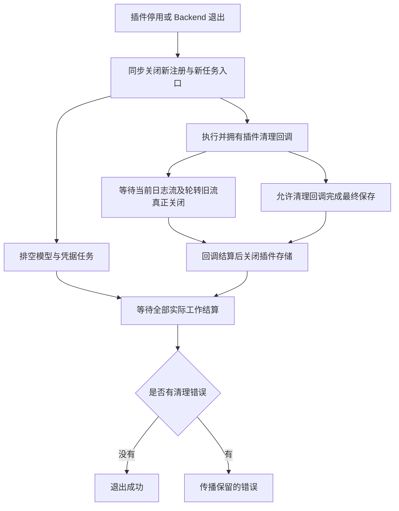

# 插件退出等待与日志流所有权

2026-09-07，后端架构调整 stage10 全量收尾发现的问题。本文补充 [主方案](backend-maintainability-plan-2026-09-06.md) 和 [实施台账](backend-implementation-status-2026-09-06.md)，不替代完整交付验收。

## 实际故障

macOS 全量 v3 自然退出 0；同源 Linux v3 的 975 文件、9,670 项断言全部通过，但出现两条未捕获 `ENOENT`，因此自然退出 1。出错文件属于 `catalog-signal.test.ts` 创建的临时目录下的 `agent-日期.log`。这不是完整通过，也不是 AppLogging 的 JSONL sink。

日志插件创建的 `fs.WriteStream` 需要异步打开文件。原 writer 的 `close()` 只调用 `end()` 后丢弃引用；文件轮转也不拥有旧流的实际关闭。原 API 调用 `onDispose` 回调时丢弃返回值，Backend 的插件 drain 只等待模型与凭据任务。于是关闭接口已经返回，目录先被删除，未完成的打开随后失败；流没有错误监听，错误逃逸到测试进程。

独立真实文件复现也确认：旧版 `await writer.close()` 返回时，流仍 `pending=true/closed=false`。修复后同一诊断返回时 `closed=true`。本地证据：`/tmp/onething-plugin-log-close-diagnostic-v1.log`、`/tmp/onething-plugin-log-close-diagnostic-v2.log`。Linux 全量失败记录保留在 `/tmp/backend-stage10-linux-full-20260907-v3/`。

## 退出契约

`disposePlugin` 仍同步发起关闭，`drainPlugin` 是实际完成入口；管理器的停用、刷新、替换和 shutdown 必须等待完成。同步插件保持立即关闭写入入口的行为。异步 `onDispose` 回调可以在等待后完成最终保存，宿主直到这些回调真正结算后才关闭其存储。

日志 writer 从创建时就监听流的错误和实际 close，保留首个 I/O 错误。停止接收新写入后，处理已经接受的缓冲，结束当前及轮转旧流，等待每个真实 close。重复 close 返回同一个 Promise；新流成功不能清除旧流的错误，某个流失败也不能让其他流的关闭被跳过。

Core API 在调用清理回调之前登记完成 Promise，避免重入或迟到 drain 丢失所有权。回调和最终存储关闭的错误归该 Promise 持有；先失败的回调不阻止其他清理执行。Backend 等待 disposal、模型与凭据任务全部结算后再返回错误。

管理器按实例保留失败，避免一个已经结算并从活动表删除的失败，在稍后的 shutdown 中变成成功。关闭期间等待的刷新或启用操作，需要在等待结束后重新检查代次与关闭状态。错误不会用重新安装一个新实例来掩盖。

## 验证与测试调用方

核心日志流的 2 个测试文件、19 项定向测试通过，包含真实异步打开失败、close 先于 open 完成、轮转旧 fd 仍未关闭、新流成功不能覆盖旧错误，以及所有流真正关闭后才上报失败。Node 类型和架构边界通过，独立代码复核无新增具体问题。日志 `/tmp/log-monitor-owned-io-frozen.log`。

Backend 侧 `catalog-signal`、`on-dispose-persistence` 和 `builtin-teardown` 组合 3 文件/10 项通过。这些测试改为等待实际 shutdown/drain，并在日志流已关闭后才删除目录；清理失败保留目录并恢复环境。原来的事件循环轮数及固定延时不再承担完成判断。异步最终保存、重复关闭和首错之后仍等待另一回调保存均有实际 API 回归。日志 `/tmp/claude-preload-stage10-plugin-close-integration-v2.log`。

插件管理器的 4 文件/39 项定向回归通过，其中新增 12 项等待屏障测试，覆盖先失败仍等待慢清理、已经结算的错误在后续 shutdown 可见、关闭与刷新/重新初始化并发，以及 API factory 同步失败时仍等待另一 entry 的实际清理。等待后的代次检查与 load 阶段的 allSettled/drain 已接通。日志 `/tmp/claude-preload-stage10-manager-disposal-v4.log`。

模块级回归：macOS 71 文件/970 项通过，另 2 项跳过，7.10 秒；Linux 同范围在一次首次模块加载超时后，单文件 28 项复验通过，将共享模块加载移入 beforeAll（未改行为断言或时限），完整模块重跑 970 项通过、2 项跳过，5.93 秒。日志 `/tmp/claude-preload-stage10-plugin-module-mac-v1.log`、`/tmp/claude-preload-stage10-plugin-module-linux-v2.log`；初次 Linux 超时日志保留。

Node 与桌面类型、架构边界均通过；CLI、Server、Desktop shell 已在 macOS/Linux 实际重建。最终 v4 全量使用相同的 3,705 个源码/配置文件，摘要 `1128972ab0bece7f13fd201991a462fe9a272498064ae0f02ba072edcb96c3fe`，两边运行前后均未变。

Linux 全量 976 文件/9,689 项通过，另 3 文件/9 项跳过，79.89 秒、exit 0。macOS 全量 975 文件/9,688 项通过，1 文件/1 项失败，另 3 文件/9 项跳过，60.48 秒、exit 1；唯一失败属于 HTTP 文件监听 SSE 超时。两边均未再报告本节日志流错误，插件退出回归通过；这仍不是 macOS 全量通过。报告 `/tmp/backend-stage10-linux-full-20260907-v4/`、`/tmp/backend-stage10-macos-full-20260907-v4/`，剩余失败的定位见 [实施台账](backend-implementation-status-2026-09-06.md)。
