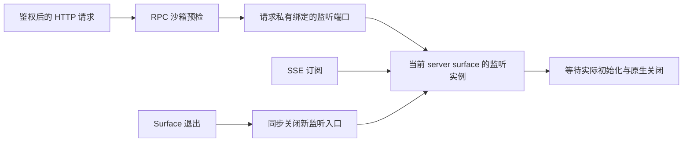

# 工作区监听的就绪与实例所有权

2026-09-07，stage11。继续实施 [后端主方案](backend-maintainability-plan-2026-09-06.md)。macOS/Linux 最终同源全量和实际 macOS 隔离应用包验证已通过；不替代主方案的完整交付条件。

## 问题与实现

stage10 的 macOS v4/v5 全量分别失败于同一 HTTP 文件监听用例。旁路记录证明 fs.watch 返回后未发生原生回调，超时后才关闭；同一临时目录的单文件验证通过。独立原生流的 HistoryDone 探针在当前环境成功，证据与仍无法排他归因的限制保留在 [调查记录](backend-workspace-watch-investigation-2026-09-07.md)。

新 [workspace-watch-driver.ts](../../packages/backend/wiring/files/workspace-watch-driver.ts) 同步返回拥有 `ready` 与 `close()` 的句柄。macOS 动态加载固定版本 fsevents，使用独立原生流，丢弃历史业务事件，等待 HistoryDone 才报告就绪；不写就绪文件，不靠固定延迟判成功。原生就绪失败明确拒绝，不静默回退。非 macOS 继续使用 fs.watch 的递归及既有非递归后备路径，不加载 macOS 扩展。

关闭会同步停止回调和取消未完成的就绪等待，再等待真正的模块加载、路径解析及原生关闭。主动取消只使未完成的 ready 拒绝；真实初始化、I/O 或关闭错误保持可见。已经排队的回调不能在关闭后通知。macOS 事件从物理路径映射回调用方路径，根外路径被拒绝；丢弃、根变化等信号发送根目录变更，提示重新扫描，不能被当成完整增量事件。

原来按沙箱根分组的进程全局 Map 已移除。[workspace-watch.ts](../../packages/backend/wiring/files/workspace-watch.ts) 提供实例工厂，每个 server surface 拥有自己的监听器和订阅者。开始异步 stat 前就登记任务；重复启动共享同一 ready。停止先取消已创建的驱动，再等待初始化与实际关闭，避免等待 ready 自锁。关闭失败仍归实例持有，稍后退出不能变成成功，其他监听器的关闭也不会被跳过。

RPC 信封、客户端和 shared context 类型不增加服务对象。[workspace-watch-context.ts](../../packages/backend/rpc/workspace-watch-context.ts) 通过 backend 私有 Symbol 绑定当前 surface 的两个窄端口；它不可 JSON 传播，也不查全局服务槽。文件域继续先执行既有沙箱检查，再读取能力；缺失绑定明确失败。桌面与既有可信宿主分支保留原有行为。

Runtime 退出在第一个 await 之前关闭监听入口，稍后等待实际关闭。两个 runtime 即使使用相同 scope/root，也不能停止对方监听。旧实例、旧 HTTP listener 或旧绑定 context 在关闭后不能创建新资源。

复核还发现关闭后的 SSE 先发送 200 再因订阅失败抛错的问题。现在先建立订阅再发送 headers，同步初始事件暂存至 connected 后发送；初始化失败退订。响应已经开始后发生错误时终止该响应，不再重复写入 500 headers。

## 验证进度

- Service 所有权与原文件域组合 2 文件/24 项通过，1.30 秒。覆盖就绪共享、stat 期间关闭、取消等待、同根实例隔离、晚通知拒绝、首错仍等待其他关闭，以及既有桌面/沙箱语义。
- 原生驱动与既有 HTTP 整文件 2 文件/49 项通过，6.26 秒，含真实首次写入和只读目录已有文件的一次更新。
- 首版双实例 HTTP/RPC/SSE 4 项通过，5.88 秒；增加关闭后旧 SSE 正常 500 的回归后，相关 6 文件/80 项通过，6.90 秒。再增加同步初始事件与响应启动后编码失败，最新 ownership 文件 6 项通过，7.01 秒。
- Linux 首轮同组 78 项通过、1 项构建检查失败、1 项平台跳过；类型检查发现 optional macOS 包缺席时无法解析原生模块声明。新增相邻窄声明与真实导出验证，Server 配方精确外置此包后，Linux 最新 6 文件/84 项通过、1 项平台跳过，6.87 秒；Node 类型通过，没有在 Linux 安装或加载 macOS 扩展。
- 最终驱动 18 项在当前 macOS 完整通过，1.53 秒，包括全部受控屏障与两个真实文件用例。macOS Node/桌面类型和架构边界通过；两平台 CLI、Server、Desktop shell 均实际重建。
- 打包相关两个文件共 7 项通过，2.03 秒，保留真实物理字节、原生 standalone、Node/Electron 与归档顺序验证。实际完整应用包发现的归档损坏已修复，最终包验证详见下一节。

以上分组相互重叠，不累计为总数。最终完整 Node 由正式平台入口重新发现 983 个文件；源码/配置共 3,712 文件，SHA256 `08ef1c12df9f098ad6bc6e5db43564430bc9e3fd4f7b72cd45e5d03057176f8d`，两平台运行前后均未变。

| 平台 | 文件 | 测试 | 时间与实际退出 |
| --- | --- | --- | --- |
| macOS/arm64 | 980 通过、3 跳过 | 9,725 通过、9 跳过 | 64.87 秒，exit 0 |
| Linux/arm64 | 980 通过、3 跳过 | 9,724 通过、10 跳过 | 78.50 秒，exit 0 |

此前失败的原样文件监听用例在 macOS 全量中通过（989 ms）；Linux 多跳过的一项是 macOS 原生包的实际解包/运行验证，不是跳过文件监听成功路径。报告 `/tmp/backend-stage11-macos-full-20260907-v1/`、`/tmp/backend-stage11-linux-full-20260907-v1/`。Linux 使用带 init 的断网非 root 容器与独立可写 Linux 构建输出，正式构建与源码发现范围均与报告一致。

## 原生依赖与实际应用包

`fsevents@2.3.2` 现在是根清单中的精确可选运行依赖，两个锁文件保持一致；不依赖开发工具偶然安装它。CLI/桌面共享配方和 Server 明确保留此原生包的外部导入。当前 CLI 主产物没有引用监听模块，因此它实际不包含该模块；CLI 共享配方的独立构建验证不冒充主产物原生加载证据。

实际完整应用包检查发现 electron-builder 26.4.0 的归档顺序问题：单文件 unpack 使其父 shell 输出目录先被标为 unpacked，后续文件却仍写入归档主体，造成 header 与实际字节位置不一致。最小配置修复将两个单文件规则合为现有 `apps/desktop-react/dist-electron/**`；fsevents 仅解包自己的目录，未扩大其他依赖。新增测试调用真正的 AsarPackager、FileMatcher 与归档流，修复前实际失败、修复后通过。旧 preload 测试按正式 glob 判断覆盖，继续检查物理内容与真实 native 运行。

最终隔离、未签名的应用为 `/tmp/onething-fsevents-package-fixed-20260907-BqIbYe/unpacked/mac-arm64/onething.app`。归档 SHA256 `42a0107a879b397dbb9d9e14e780f84dfddd752d2cc82a9e67ecb04e5aea4b7c`。系统 Node 22.22.3（PID 99531）与包内 Electron 41.1.1（PID 99559）分别使用包内资源完成 HistoryDone、stop、自然 close 0 和 PID 消失，未强杀、无 stderr；没有打开 GUI 或用户 store。

实际 JS 与原生二进制字节相同，桌面 main 与最终构建一致。首次证明报告仅因错误要求依赖 package.json 原字节相同而聚合失败；electron-builder 正式清理了部分元数据。该报告原样保留，补充审计使用 builder 自己的 createTransformer 验证包中元数据精确等于预期变换，引用原报告摘要，未靠重跑进程替代证据。最终 `/tmp/onething-fsevents-package-fixed-20260907-BqIbYe/package-audit.json` 为 passed。此前两个实际损坏包及负向日志保留。

## 本地证据与范围

首轮日志：`/tmp/workspace-watch-service-root-v1.log`、`/tmp/workspace-watch-driver-http-root-v1.log`、`/tmp/workspace-watch-ownership-root-v1.log`、`/tmp/workspace-watch-integration-root-v2.log`。macOS 最新 Node 类型为 `/tmp/workspace-watch-node-types-root-v4.log`，桌面类型 `/tmp/workspace-watch-desktop-types-root-v1.log`；Linux 首轮 `/tmp/workspace-watch-integration-linux-v1.log`、`/tmp/workspace-watch-node-types-linux-v1.log` 保留负向证据。

最终增量日志：`/tmp/workspace-watch-driver-root-v4.log`、`/tmp/workspace-watch-ownership-root-v3.log`、`/tmp/workspace-watch-integration-linux-v2.log`、`/tmp/workspace-watch-node-types-linux-v2.log`；macOS 新增驱动声明后的类型与边界日志由构建记录保留，桌面类型 `/tmp/workspace-watch-desktop-types-root-v2.log`、边界 `/tmp/workspace-watch-boundary-root-v2.log`。打包组合 `/tmp/fsevents-runtime-build-combined-final-v4.log`；真实归档修复前 `/tmp/fsevents-runtime-asar-regression-before.log`，旧规则断言修复前 `/tmp/fsevents-runtime-preload-rule-before.log`。两平台构建及最终包均使用独立输出证据，不以构建退出码替代包可用性。

所有验证使用隔离工作目录；未发布、未安装用户应用、未修改真实会话数据。SDK 默认宿主启用、完整云与 ACP 能力、Windows/NTFS、正式 runner、发行及回滚范围仍按 [实施台账](backend-implementation-status-2026-09-06.md) 保持未完成。
