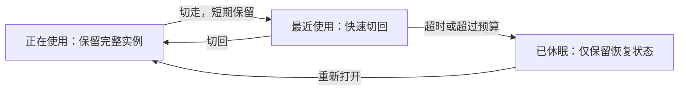

# 浏览器、终端、会话和 UI 的内存管理建议

建议采用一套共同规则：**长期保存内容与恢复状态，按需保留昂贵的运行实例；每种缓存都有容量，每项资源都有明确的释放入口。**

对这个程序，优先处理开发性能记录、会话缓存和隐藏 UI。它们已有实测依据，也较容易在保持现有使用体验的前提下回收。浏览器和终端随后补齐可恢复的休眠机制。

以下是设计建议，尚未修改程序实现。数字是第一版调优起点，不是经过压测的最佳值，也不是整机内存的硬保证。

## 先分清两种生命周期

**界面是否显示**与**任务是否执行**必须分开管理。

| 资源 | 值得长期保留的内容 | 可以回收的昂贵部分 | 必须继续保护的工作 |
|---|---|---|---|
| 浏览器 | 标签身份、URL、profile、持久化登录资料 | 可安全重载网页的 WebContents | 网页编辑、通话、传输、自动化操作 |
| 终端 | 终端身份、必要的屏幕恢复信息、有限输出记录 | xterm、DOM、显示订阅和图形资源 | PTY、构建、开发服务器、交互命令 |
| Session | 事件日志、检查点、附件文件、草稿 | 闲置投影、物化消息、大结果正文 | 正在生成、工具执行、正在提交的写入 |
| UI | 当前标签、滚动锚点、展开状态、草稿 | 隐藏组件树、DOM、高亮与预览结果 | 可见内容、尚未完成状态保存的编辑 |

例如：切走一个正在生成的会话，后台继续执行；前端只接收完成状态等轻量通知，不必保留全部消息 DOM。切走终端可以卸下画面，但不能顺手杀掉构建进程。

视图和可重建缓存可以使用三个状态：

后台任务单独维护“运行、空闲、结束”。视图进入休眠，不自动改变后台任务状态。“关闭”“停止任务”“休眠”也应是不同操作。

## 四类资源分别怎么管

### 浏览器：少量页面保活，其余按条件休眠

**建议起点：所有可见页面正常运行，另外保留最近 2 个符合条件的后台页面；超过 10 分钟未访问且允许恢复时休眠。** 超过后台页面数量预算时，可提前回收最久未用的候选页。

休眠保留标签本身以及 URL、profile、标题、缩放、可恢复的滚动位置，再释放对应 WebContents；唤醒时创建新的 WebContents 并加载页面。继续使用同一浏览器存储分区，不清 Cookie 或站点数据。[Electron 的持久化分区说明](https://www.electronjs.org/docs/latest/api/session)

这里的恢复是“重新加载网页”，不是把网页执行现场完整恢复。页面内存中的表单、JS 状态及某些临时会话状态可能无法恢复，因此需要明确的保护条件：可见、播放/通话、上传下载、自动化租约、用户选择保持运行，或已知存在未保存编辑。任意网站的编辑状态无法可靠地全部检测出来，第一版可只对明确可重载的页面自动休眠，其他页面提供手动休眠。

执行页面关闭时应尊重 `beforeunload` 的阻止结果；但网页没有设置该处理器，也不代表没有未保存内容。[Electron WebContents 关闭语义](https://www.electronjs.org/docs/latest/api/web-contents#contentscloseopts)

**当前实现需要新增可逆入口。** `Tab.dispose()` 会永久标记销毁，之后 `materialize()` 不会恢复；`BrowserService.close()` 还会删除标签身份。休眠应拆出“释放页面实例”，不能直接调用现有关闭逻辑。当前持久化只覆盖 id/url/title/profile，恢复信息也需要补充。

### 终端：优先卸载画面，后台进程按任务管理

建议保留可见终端与最近 1 个终端的屏幕，其余闲置约 2 分钟后，在确认可恢复时释放屏幕。普通终端的回滚行数可先从当前 5,000 行降至 2,000 行，并另设全局容量预算；大量输出的完整日志按需落盘、轮转，内存只保留尾部。

xterm 的 `scrollback` 限制的是行数，行宽和字符属性仍会影响实际成本；`dispose()` 负责释放终端显示实例。后台 PTY 的生命周期需要应用自己独立维护。[xterm 选项](https://xtermjs.org/docs/api/terminal/interfaces/iterminaloptions/#optional-scrollback)、[xterm Terminal API](https://xtermjs.org/docs/api/terminal/classes/terminal/)

当前有三个落地要点：

1. **新增释放屏幕入口。** 当前 React 组件卸载后，注册表仍持有 xterm；而 `closeTerminal` 会杀 PTY。需要独立的 `releaseScreen`，保存恢复状态后解除显示订阅并释放 xterm。
2. **补齐 detach 协议。** 后端已有 `markDetached()`。屏幕释放时需要通知后端，正确处理 ACK 与背压，避免后台输出因为没有界面确认而被暂停。回来时先恢复屏幕，再接续实时输出，避免缺失或重复。
3. **先解决恢复保真再扩大自动休眠范围。** 当前后端仅缓存约 100 万个 UTF-16 单元的输出尾部，截断的 ANSI 流不保证能重建屏幕。可先支持已验证恢复的普通 shell；vim、top 等全屏交互程序在有完整屏幕状态序列化前保留必要状态。不能因为几分钟没输出就判断进程可以结束。

终端子进程的内存单独列账。一个终端里跑的服务可能比 xterm 大得多，释放 UI 不会释放服务本身；结束服务属于任务操作，不应伪装成缓存回收。

### Session：统一管理投影、物化消息和大结果

这是当前最应该优先收口的业务缓存：实测 40 个会话的投影及关联物化数据可达约 129 MiB，主要是工具输出和历史文本。

**建议把完整历史留在事件日志与检查点里，把内存投影当作可以重建的缓存。** 正在执行或被可见消费者使用的会话保留；闲置会话受字节预算、最近使用顺序和超时共同约束。仅限制“最多几个会话”不够，一个大工具输出就可能超过许多短会话。

回收应覆盖同一会话的数据链：投影、物化消息、补水的附件正文、工具结果正文以及其他强引用。仅删除一个 Map 条目，其他持有者仍可能让数据无法回收。恢复时从检查点和后续事件重建，不重新运行已经完成的工具。

大文本和附件尽量只保留引用、大小、摘要及预览片段；展开、复制或导出时再按需读取。前端缓存也遵守同样规则，减少后端投影、物化消息、前端数据源、Markdown 模型同时长期保存同一大结果的机会。

正在生成、读取或提交写入的会话使用明确的使用租约，保证回收不会与流式更新竞争。恢复中防止旧异步结果重新写回已回收的对象。标签仍存在，并不意味着它需要一直占用整份投影。

### UI：保存状态，只让少量组件常驻

**建议保留所有可见面板，额外只预热最近 1 个会话界面，切走 30–60 秒后卸载；内存紧张时取消额外预热。** 这个上限按整个应用计算，避免每个 pane 都额外保留 3 个会话，随布局数量放大。

把草稿、滚动锚点、工具展开状态、选中消息等放到独立的小状态对象里。卸载时保存，重新挂载时恢复。这样用户仍能“接着上次的位置看”，不需要为此始终保留整棵 DOM。内存回收不能复用会清掉草稿的“关闭会话”业务入口。

聊天列表应保持真正有界：只渲染视口附近的消息或内容块，并保留上下缓冲；向上滚动时按需加载。当前空闲时最终扩展到所有已加载历史的做法需要调整。单条超长工具结果也要截断预览或按块渲染，否则只限制消息条数仍然不够。全文查找、复制和导出从数据层完成，不依赖所有历史都在 DOM 中。

`content-visibility` 适合降低隐藏内容的渲染成本，不能承担内存释放。React `Activity` 能在隐藏时清理 Effect，但仍保留状态和 DOM，适合短期预热，长期回收仍需要卸载。[React Activity 文档](https://react.dev/reference/react/Activity)

代码高亮语言按需加载；解析结果、高亮 token、SVG 和图片预览设置字节预算，回收时同步解除引用、订阅和计时器，并释放已不使用的对象 URL/图形资源。

## 第一版预算可以这样设

先给**可回收缓存**设预算，不把活跃任务和第三方网页硬塞进固定总量。

| 缓存池 | 建议初值 | 淘汰条件 |
|---|---:|---|
| 后端闲置 session 投影及物化数据 | 64 MiB，最多 4 个闲置完整会话 | 任一上限触发，或闲置超过 5 分钟 |
| 前端闲置会话数据 | 32 MiB，最多 3 个会话 | 任一上限触发，或闲置超过 3 分钟 |
| Markdown / 高亮 / 图表等派生缓存 | 16 MiB | 最近最少使用优先；单项过大不进入缓存 |
| 终端输出回放池 | 16 MiB 总预算，单终端约 1–2 MiB | 淘汰历史尾部前先满足恢复与日志策略 |
| 不可见 UI | 最近 1 个，保留 30–60 秒 | 超时、超额或内存压力时卸载 |
| 可休眠的后台网页 | 最近 2 个，最长预热约 10 分钟 | 超额或超时，且不存在保护条件 |

前四项约 128 MiB 是用于控制自有缓存的初始账面预算，不能等同于进程实际内存：JS 对象开销、共享数据、原生分配和图形资源仍需观测。字符串与 Buffer 可以增量估算大小，再用实测堆校准；不要频繁序列化整份缓存来“精确计量”，那会制造额外分配。

活跃会话可以暂时超过预算，但必须单独显示“受保护占用”和原因。预算超额时先停止预热、回收闲置数据；无法安全回收时显示来源，让用户决定结束哪个任务，不自动杀业务进程。

## 用一个小的协调层统筹

无需先做复杂框架。让浏览器、终端、session、UI 各自拥有自己的资源与恢复逻辑，再向统一协调层报告：**谁持有、最后使用时间、大约多少内存、为何受保护、能回收什么、如何恢复**。

协调层只负责账目、预算和发起回收请求；各模块再次检查能否回收并执行。不要由协调层直接遍历并销毁业务对象。

建议的回收顺序是：

1. 过期诊断记录、可重算的解析和预览缓存。
2. 隐藏 UI、闲置前端数据和闲置后端投影。
3. 符合条件的后台网页、可恢复的终端屏幕。
4. 活跃任务只报告，不自动停止。

预算触发时一批一批回收，降到预算约 80% 后停止，留出余量；唤醒也限制并发，避免同时重建十个页面造成瞬时峰值。持续通过预算和资源生命周期控制增长，GC 留给运行时管理，不把定时强制 GC 当作常规方案。

## 给自己一张能看懂的账单

开发诊断面板同时显示两层信息：

- **进程账目**：主进程、界面、GPU、网页 renderer、终端子进程、MCP、开发服务。展示实际进程指标，并注明测量口径。
- **资源账目**：活跃/预热/休眠数量，各缓存估算字节，使用者数量，保护原因，最近一次回收结果，以及恢复耗时。

这两层不要强行合成一个精确数字：多个网页可能共享 renderer，GPU 也可能共享，堆中对象之间还会共享字符串。能归属的显示明细，不能精确归属的明确标为共享或估算。

用户界面只需少量操作：“休眠后台网页”“释放闲置界面”“保持运行”，并区分“停止任务”。不需要让用户调整每一种缓存的十几个参数；先提供一套均衡默认值。

MCP 和旧后台也应纳入同一份账单。可核实同配置、同身份且允许共享的连接是否能复用；有活跃调用或订阅的服务必须保护。之前发现的两个 chrome-devtools MCP 和旧后台不能仅凭名称相同就自动合并或终止。

## 推荐实施顺序与验收

| 顺序 | 工作 | 能检验的结果 |
|---|---|---|
| 1 | 开发模式性能记录设保留上限，增加缓存/实例计数 | 不再随每次组件渲染无限积累；显式性能录制仍可用 |
| 2 | 后端 session 字节预算，大工具结果按需读取 | 浏览大量历史会话后，闲置完整投影数量和字节有上限 |
| 3 | UI 状态与实例分离，限制预热，历史窗口保持有界 | 切换很多会话后 DOM 数回到稳定区间，草稿与位置能恢复 |
| 4 | 浏览器可逆休眠、终端 detach 与屏幕恢复 | 网页不会丢未保存工作；终端画面回收后命令继续运行 |
| 5 | 结合实测调整预算，核实 MCP 与旧后台生命周期 | 整体增长可解释，回收与恢复成本在可接受范围 |

用固定数据反复跑“打开 → 使用 → 切走 → 回收 → 恢复”循环。重点检查内存是否进入稳定区间，而不是要求每次都回到同一个 MB 数；同时测恢复耗时和切换卡顿。必须覆盖流式生成不中断、终端后台输出不断流、TUI 恢复、浏览器编辑保护，以及草稿和滚动锚点不丢失。

## 对应当前实现的位置

- [本次实测报告](/Users/yitiansong/data/code/start-electron/docs/audit/runtime-memory-breakdown-2026-09-16.md)
- [浏览器页面创建与销毁](/Users/yitiansong/data/code/start-electron/apps/desktop-react/electron/browser/tab.ts:170)、[现有标签持久化](/Users/yitiansong/data/code/start-electron/apps/desktop-react/electron/browser/tab-state.ts:138)
- [终端注册表与关闭入口](/Users/yitiansong/data/code/start-electron/apps/desktop-react/src/content/terminal/registry.ts:122)、[回滚行数](/Users/yitiansong/data/code/start-electron/apps/desktop-react/src/content/terminal/screen.ts:91)、[后端 detach](/Users/yitiansong/data/code/start-electron/packages/onething-runtime/src/terminal/service.wiring.ts:214)
- [后端会话投影](/Users/yitiansong/data/code/start-electron/packages/backend/session/projection-cache.ts:103)、[物化消息缓存](/Users/yitiansong/data/code/start-electron/packages/backend/session/materialized-messages.ts:80)
- [前端会话数据停靠](/Users/yitiansong/data/code/start-electron/apps/desktop-react/src/data/chat-source.ts:2291)、[UI 会话停靠](/Users/yitiansong/data/code/start-electron/apps/desktop-react/src/content/session-park.ts:90)、[历史逐步全量挂载](/Users/yitiansong/data/code/start-electron/apps/desktop-react/src/content/ChatStream.tsx:821)
