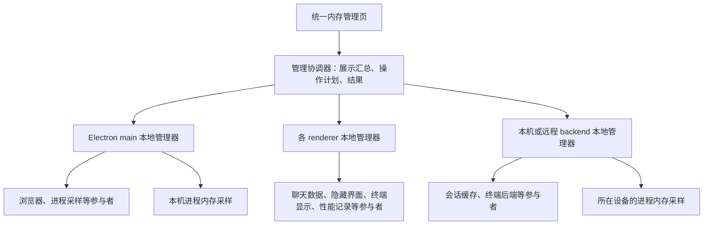

# 统一内存管理方案

状态：设计提案，待评审；本次只新增设计文档，不修改应用代码。

日期：2026-09-16

## 1. 推荐方案

建立一套**统一的运行时内存管理机制**：各功能在创建资源的地方登记自己的内存参与者，统一页面展示当前占用和可执行操作，统一策略决定何时尝试回收，资源所属模块负责安全释放与恢复。

这套机制同时服务两个目标：用户能知道内存用在哪里、哪些可以释放；应用能持续控制闲置资源和缓存的增长。后续增加 PDF 预览、模型加载或其他功能时，只需在模块内部实现接入约定，管理页和调度器便能发现它。

推荐采用“统一管理器＋模块适配器”，保留现有功能的业务生命周期。

| 路线 | 功能范围 | 优点 | 代价与不足 |
|---|---|---|---|
| 只增加内存面板 | 展示进程、资源数量、各功能已有操作 | 最容易开始，改动小 | 每增加一种功能都要改页面；回收规则仍然分散，难以持续降内存 |
| **统一管理器＋模块适配器，推荐** | 统一观测、能力发现、保护条件、预算、回收调度和结果记录 | 能逐步接入已有模块，新功能按约定自然加入；各模块仍掌握自己的数据安全 | 需要先定义协议；浏览器和终端仍需各自补齐恢复能力 |
| 重建全部资源生命周期 | 所有功能改为统一创建、引用计数、挂起和恢复 | 长期控制能力最强 | 迁移范围大，容易影响任务、编辑状态和跨端连接，当前没有必要一次做到 |

首版按第二条路线建设，但只开放已经具备安全释放条件的能力。

## 2. 从现状出发

此前采样已经说明，内存来源分散在不同层，单独加一个“清理缓存”按钮覆盖不了主要问题。

| 当前落点 | 已确认的现状 | 对设计的影响 |
|---|---|---|
| 开发环境性能记录 | 曾累积约 17.8 万条 PerformanceMeasure；受控清理后，UI 进程 footprint 在该次实验中下降约 192 MiB | 为开发诊断数据建立有上限的保留策略；这项收益不能外推为生产环境收益 |
| 后端会话 | Repository 已有默认 10 项缓存，但另外存在投影、物化消息和读取索引；一次快照中投影涉及 40 个会话 | 现有缓存统计不足以描述会话的全部内存，需要按持有层登记并由会话模块协调回收 |
| 前端会话 | 每个 pane 有最近界面的保留池，聊天数据另有停靠池；打开的标签页也可能继续持有组件 | “隐藏界面”“无订阅者”“消息已保存”必须分别判断 |
| 浏览器 | 已有页面身份、列表和关闭能力；当前销毁逻辑不提供可靠的再次物化路径 | 可立即纳入观测；休眠需要额外的释放、恢复协议 |
| 终端 | 终端显示、前端缓冲、后端 PTY、命令子进程分别持有资源 | 可先管理已退出终端和缓冲；不能把停止输出视为任务闲置 |
| 主进程、GPU、共享服务、开发工具 | 许多内存无法准确归到某一个标签或会话 | 必须保留进程视图和共享占用，不能强行将总内存分摊给业务对象 |

原始调查见[运行时内存分析](/Users/yitiansong/data/code/start-electron/docs/audit/runtime-memory-breakdown-2026-09-16.md)。调查里的对象可达大小、字符串估算和进程 footprint 是不同口径，不能相加。

仓库中的前期 memory 草稿不视为已完成能力；本方案不依赖其未经验证的回收行为。

## 3. 整体结构

这里的“本地”指真正持有资源的运行环境。一个 renderer 无权直接删除 backend 的缓存；远程 backend 也不会被算进当前电脑的应用占用。

同一物理进程可能同时承载 Electron main 和内嵌 backend，逻辑模块可以分别登记，但进程内存只能计一次。

### 三个职责层

| 层 | 负责什么 | 数据与动作边界 |
|---|---|---|
| 模块参与者 | 报告自己已持有的资源、保护原因、支持的动作；执行释放和恢复 | 最清楚对象能否丢弃，拥有最终执行判断权 |
| 本地管理器 | 登记参与者、采样、应用本地预算、串行调度有冲突的操作、保存有限结果 | 只管理所在运行环境；离开管理页后仍能维持已启用的预算策略 |
| 管理协调器和页面 | 汇总不同宿主的数据，按用户选择生成操作计划，展示结果 | 跨宿主操作允许部分成功，不承诺分布式原子回收 |

统一的是协议、操作语义、预算与展示方式。各模块的关闭、保存、任务执行和恢复实现仍留在各自模块中。

### 与现有资源系统的关系

- 继续使用现有 `ResourceRef` 关联会话、网页等业务身份。
- 现有 `ResourceRegistry` 是 `scheme → ResourceSpec` 的业务能力目录；另设轻量的运行时目录，记录谁在当前进程中持有资源。一次会话可以对应多个运行时条目。
- 沿用现有装配与注销模式、RPC/event 连接，不引入独立常驻服务或新 socket。
- 内存请求按宿主运行身份定向。现有 shell 派发按 scheme 找单一 shell，不能直接用它代表多个窗口中的同类缓存；需要在现有连接上补充按宿主定向的内部协议。
- `BackendResources.own()` 用于管理采样器、注册和订阅本身的关机清理。现有业务 `dispose`、provider 卸载和后端关机流程不成为内存回收动作。

## 4. 统一接入约定

### 登记参与者，而非登记每一个大对象

通常每个模块或缓存池登记一个参与者，例如“后端会话缓存”“聊天数据停靠池”。参与者按需枚举已有实例，列表支持分页和汇总。管理器不保留全部消息、DOM、网页内容或终端输出。

模块装配时登记，模块退出或热更新时注销。新增功能最低只需提供只读统计；有可靠释放能力后，再声明对应操作。

| 约定 | 提供内容 | 要求 |
|---|---|---|
| 描述 | 稳定参与者 ID、展示名称、分组、协议版本 | 分组用于展示；核心调度不依赖浏览器、终端等名称分支 |
| `inspect` | 已有实例、计量依据、最后使用时间、轻量汇总 | 不加载会话、不创建终端、不恢复网页；大列表分页 |
| `assess` | 当前支持的动作、保护原因、估计收益、恢复代价 | 只提出候选，不能代替执行时检查 |
| `reclaim` | 执行某个明确动作，返回分项结果 | 检查实例版本、当前保护条件与权限，保证重试不会重复执行 |
| 恢复契约 | 恢复入口、恢复来源、必须保存的状态、可能丢失的临时状态 | 可以沿用模块原有的按需加载入口；不能保证恢复就不声明休眠能力 |
| 注销 | 解除登记、订阅、采样及回调 | 注销参与者不代表关闭业务对象；已有运行任务由原有生命周期负责 |

### 身份和状态

每个条目应至少具有这些身份：

| 字段 | 用途 |
|---|---|
| 设备身份 | 区分当前电脑与远程设备 |
| 宿主 ID＋本次运行 epoch | 区分 main、backend、各 renderer 及其重启前后 |
| 参与者 ID | 定位拥有资源的模块 |
| 实例 ID＋generation | 区分同一业务对象被释放后重新创建的运行实例 |
| 可选 `resourceRef` | 将不同层的条目关联到同一会话、网页或其他业务对象 |
| 物理进程实例标识 | 使用设备、PID、进程启动身份去重，避免 PID 复用与重复计数 |

条目同时报告四类状态：是否被界面使用、是否有后台工作、数据是否已持久化、当前内存驻留状态。它们不能合成一个“活跃/闲置”布尔值。

例如，一个会话可处于“界面已卸载、任务运行中、执行状态受保护”；一个失败消息可处于“界面隐藏、任务已结束、本地内容未保存、数据缓存受保护”。

### 三类内存操作

| 操作 | 语义 | 示例 |
|---|---|---|
| 清理可重建数据 | 删除派生缓存，保留业务身份和源数据 | 清理已保存会话的读取索引、可重新计算的渲染缓存 |
| 卸载闲置显示 | 释放显示实例，保留恢复所需状态及业务执行 | 卸载受保护条件检查通过的隐藏会话界面 |
| 休眠可恢复实例 | 保存必要状态后，释放运行实例，使用时重新创建 | 后续具备完整恢复契约的浏览器页面 |

关闭网页、终止命令、删除会话属于现有业务操作，单独呈现其后果，不纳入自动回收，也不作为回收失败后的兜底。

一个动作可能影响多个关联条目。参与者必须报告影响范围，避免释放一个 UI 引用时，间接触发数据池淘汰而遗漏未保存消息的保护。

## 5. 内存如何计量

### 两套数据，分别展示

**进程实际占用**用于回答“应用当前在这台设备占多少内存”。统一展示采样时间、单位和计量口径，按物理进程去重，保留主进程、UI、浏览器、GPU、终端子进程等分组。未能定位用途的进程仍然展示。

**模块资源统计**用于回答“哪个模块持有什么、能做什么”。可展示实例数量、文本或 buffer 大小、估计占用、共享关系、可释放项数、保护原因。取不到字节数时展示“大小未知”，不能填 0。

两者在页面上相邻，但不相加。模块估算不做成一张声称精确分摊总内存的饼图。

计量规则：

1. 统一以 bytes 传输，界面用 MiB/GiB；每项携带采样时间、方法、范围和可信程度。
2. macOS 优先使用经验证的进程 footprint 口径；只拿到 RSS 时明确标为驻留内存，不与 footprint 混成一个总数。首阶段需验证采样 API 的可用性与开销。
3. 共享 renderer、共享字符串、多个缓存共同引用的数据使用共享组或包含关系标注。父汇总和子项不能重复相加。
4. 本机 backend 子进程、PTY 子进程、工具进程按实际所属进程树归类和去重；开发服务器、独立旧服务等放入“关联进程”，明确是否计入应用总数。
5. 远程 backend 独立显示设备与总量；断线显示“数据已过期”，不显示为 0。
6. 操作结果分别报告“移除了哪些实例或估算缓存”与“采样期间进程占用变化”。GC、分配器、压缩与并发工作会影响实际数字，不能承诺删掉估算 100 MiB 就立即归还系统 100 MiB。
7. 日常统计不生成 heap snapshot、不遍历完整对象图、不强制 GC。深度诊断作为单独的显式诊断功能。

“应用合计”是所选进程在同一计量口径下的汇总。跨进程共享页的归属遵循操作系统的计量方式，因此页面应保留口径说明，不能将这个合计声称为应用独占的全部物理内存。

## 6. 如何安全地降低内存

### 保护条件由资源所有者维护

标准保护原因包括：当前可见消费者、后台任务运行、待保存内容、写入进行中、恢复进行中、等待交互、自动化正在使用、用户要求保持运行。

保护按动作和资源部分生效。例如，后台会话任务保护执行状态，但不必阻止另一个可独立恢复的隐藏显示实例被卸载。

跨宿主消费者可以使用带作用域的保护租约。本地真实状态仍是安全判断依据；连接断开或租约超时，不自动证明任务已结束或内容已保存。状态无法确认时标为受保护或不可判断。

### 一次回收的流程

1. 协调器读取快照，列出候选、动作、保护原因及预计影响，形成操作计划。
2. 执行请求携带操作 ID、宿主 epoch、实例 generation、目标动作和预期版本。
3. owner 在同一受控临界区重新检查条件，并进入回收状态；之后发生的新订阅或使用请求必须进入同一协调流程。
4. 若新需求到达，owner 安全取消尚未提交的释放，或完成释放后合并恢复；不能同时销毁和交付同一实例。
5. 结果区分完成、受保护、状态变化而跳过、部分完成、宿主不可用、失败和仍在执行。
6. 用户重新访问时，模块走既有加载入口恢复；并发访问合并为一次恢复，恢复失败保留业务身份与重试入口。

同一实例的冲突操作串行化。旧请求不能影响新实例。超时只意味着暂未收到结果；重试使用同一个操作 ID，并支持查询结果，不能把超时直接显示为“已取消”。

### 预算与优先级

预算分为两层：

- **模块预算**：限定可回收缓存的条目数、字节估算或保留时间。模块根据数据特点提供默认值和安全下限。
- **宿主预算**：结合进程趋势与系统压力，在模块中挑选可执行动作。预算是尽力满足的软目标；受保护的工作可能让占用继续超过目标。

先有可验证的模块上限，再引入系统压力调节。候选排序使用通用属性：可执行性、闲置时间、恢复代价、估计收益和用户偏好。没有准确字节估算的模块也可以按条目数管理。

同一个资源只接受一条串行回收路径。已有模块内的淘汰机制接入统一政策和保护检查，避免管理器与模块各自定时清理同一份缓存。

自动策略采用有限批次、冷却时间、进入和退出阈值，执行后重新采样，避免刚卸载又恢复的循环。没有可回收项时展示原因，保留正在进行的工作。

不以清空磁盘缓存、删除登录状态或频繁强制 GC 作为主要降内存手段。

## 7. 第一批模块怎么接入

| 模块 | 首批观测 | 首批可开放操作 | 后续能力及前置条件 |
|---|---|---|---|
| 性能记录 | 记录数量、保留范围、是否处于诊断保留模式 | 对已识别的应用/开发记录应用有上限的保留策略 | 诊断模式可临时延长保留，同时显示自身成本；保留策略需与已有 perf 采集协同 |
| 后端会话 | Repository、projection、物化消息、读取索引的条目与保护状态 | 由 session owner 协调清理已持久化且无冲突工作的闲置缓存 | 写入、执行、未合并状态的检查贯穿各层；下次读取能从持久化数据恢复 |
| 前端聊天数据 | 被使用与停靠的数据源、待保存或失败消息、消费者数量 | 清理确认可恢复且不持有本地唯一数据的停靠条目 | 草稿、本地消息和交互状态获得明确的持久化或保护协议 |
| 会话界面 | 可见、隐藏、最近保留的显示实例 | 在状态可恢复且不会连带损失数据的条件下卸载隐藏实例 | 按业务身份恢复滚动位置、选择和必要交互状态；长列表逐步做真正的有界渲染 |
| 浏览器 | 页面身份、是否物化、可关联进程、保护原因 | 首阶段只观测；具备独立安全契约的派生缓存可另行接入 | 新增保留 tab 身份的休眠/再创建流程；保护编辑、媒体、传输与自动化，无法判断则跳过 |
| 终端 | 显示实例、缓冲规模、PTY/命令状态、对应子进程 | 已退出终端的可恢复显示与明确可截断缓冲 | 活跃终端显示休眠需完成 detach/attach、流序号与屏幕恢复协议；仅有 ANSI 尾部不足以恢复全部 TUI 状态 |
| 高亮、图形等共享缓存 | 数量、估算、引用关系 | 逐个确认可重建和引用安全后接入 | 活跃渲染或导出依赖的对象继续受保护 |
| GPU、平台共享服务、外部工具进程 | 进程级占用与关联关系 | 首阶段观测 | 后续若明确 owner 与释放契约再加入动作；不能因占用高直接杀进程 |

浏览器的持久化 profile 能保留部分站点数据，不等于能恢复任意表单、JS 状态或 sessionStorage。终端界面不再显示，也不等于可以停止 PTY。

现有 `clearAllSessionCache`、`resetAll`、业务 `ContentKind.dispose`、浏览器 `close`、终端 `close` 等接口，都需要按真实语义逐一判断，不能统一改名后直接接入。

## 8. 用户看到的功能

在设置中增加“内存”入口；以后可以让状态栏显示轻量摘要，点击进入同一页，避免再建设第二套管理功能。

页面分为四块：

1. **当前状态**：当前设备总占用、短期趋势、采样时间与口径；远程设备单独列出。
2. **资源列表**：按功能或所属会话/标签查看，列出数量、占用或估算、使用状态、保护原因、支持的操作。可切换到进程视图。
3. **释放操作**：逐项执行或批量“释放闲置资源”；提前显示影响范围，完成后显示成功、跳过和失败项。未知收益不伪造数值。
4. **管理策略**：选择模式，查看模块预算与例外，查看有上限的最近操作记录。

建议提供三个模式，按阶段开放：

| 模式 | 行为 | 适用取舍 |
|---|---|---|
| 观察 | 查看状态和手动释放；保留模块基本容量上限 | 最少后台调度，用户自行决定何时释放 |
| 均衡 | 自动回收符合保护条件的闲置缓存；只使用已验证动作 | 推荐成熟后的默认模式，在恢复速度与占用之间折中 |
| 节省内存 | 缩小闲置保留量、优先卸载可恢复显示；仅在后续支持时休眠页面 | 占用更低，但切换时可能重新加载；仍保护运行工作和本地唯一数据 |

第一版不开放尚未验证的页面休眠或活跃终端休眠。安全条件、来源权限和恢复能力不能通过切换模式绕过。

“保持运行”应明确作用范围，例如保持网页实例或保留某个会话显示；不应默认将该对象所有派生缓存永久固定在内存。

## 9. 新功能接入示例：PDF 预览

假设后续加入 PDF 预览功能，可按下面的过程接入：

1. 在 PDF 模块装配时登记参与者，管理页自动出现“PDF 预览”。
2. 模块报告已打开文档的解析器、页面位图缓存、当前可见页与未保存批注，不为统计主动解析其他文档。
3. 先声明“清理非可见页面位图缓存”，保护正在显示、导出或使用的页面；没有可靠恢复协议时不声明释放解析器。
4. 明确恢复来源与页码、缩放、批注等状态的保存方式后，再增加卸载解析器能力。
5. 提供恢复代价、最后使用时间、缓存上限等通用属性，管理器即可按预算调度。
6. 模块退出时注销参与者及订阅，页面中的旧条目失效。

整个过程只修改 PDF 模块和其装配登记点；无需增加中央 `if PDF` 分支、专属清理按钮或新的内存后台服务。复杂说明可以通过标准描述字段提供，任意插件 UI 不进入核心管理页。

接入验收清单：统计不创建资源；操作前复核保护；恢复路径可验证；重复请求安全；旧实例不能被误操作；注销释放引用。只实现统计也属于合法接入。

## 10. 工程落点

以下是建议的职责位置，均为拟定，不表示本次已创建代码文件。实施前可依据仓库模块规范调整命名。

| 建议位置 | 职责 |
|---|---|
| `packages/core/memory/`（拟新增） | 不依赖 Electron/React 的接入契约、本地注册表、操作状态和策略基础；保持小范围 |
| `packages/shared/ipc/memory.ts`（拟新增） | 可序列化快照、能力、请求与结果，协议版本和访问范围 |
| backend 装配与 RPC domain | 装配 backend 本地管理器、登记 session/terminal 参与者，承接有权限检查的请求 |
| Electron main 侧 memory service（拟新增） | 本机进程采样、浏览器参与者、本机宿主连接；通过窄 IPC 暴露能力 |
| renderer 侧 memory service（拟新增） | 登记聊天数据、显示池、性能记录、终端显示参与者，连接统一页面 |
| 各功能已有 owner | 实现 inspect、保护与具体释放恢复；管理器不直接操作其内部 Map |
| Settings 的内存页（拟新增） | 订阅标准快照，按能力渲染；不承载淘汰策略 |

可以复用的现有锚点：

- [业务资源目录](/Users/yitiansong/data/code/start-electron/packages/core/resource/registry.ts:79)：复用业务身份关联，保留目录原有语义。
- [后端资源装配](/Users/yitiansong/data/code/start-electron/packages/backend/wiring/resource/index.ts:200)：沿用模块装配与注销方式。
- [后端生命周期](/Users/yitiansong/data/code/start-electron/packages/backend/lifecycle.ts:80)：登记管理器自身的关闭与注销。
- [Shell 宿主](/Users/yitiansong/data/code/start-electron/apps/desktop-react/src/resources/shell-host.ts:136)：复用宿主运行身份、连接和退订生命周期。
- [Shell 路由限制](/Users/yitiansong/data/code/start-electron/packages/backend/wiring/resource/shell-registry.ts:160)：内存协议需要另外支持按宿主定向。
- [当前会话缓存接口](/Users/yitiansong/data/code/start-electron/packages/backend/rpc/domains/sessions.ts:587)：保留现有访问控制，将观测范围扩展至会话实际持有层。
- [Settings 页面目录](/Users/yitiansong/data/code/start-electron/apps/desktop-react/src/content/settings/pages.tsx:62)：统一用户入口。

## 11. 分阶段交付范围

| 阶段 | 交付内容 | 能解决什么 | 完成标准 |
|---|---|---|---|
| A：统一观测底座 | 最小参与者契约、各宿主只读统计、进程采样、内存页 | 知道内存所在设备、进程和模块，看到未知项与保护原因 | 新增只读参与者即可自动显示；数据不重复计数；统计不加载资源 |
| B：可控回收 | 明确性能记录保留、会话各层协调回收、合格停靠数据与隐藏 UI 释放；手动操作和模块容量上限 | 控制已经确认的增长点，支持用户主动降低闲置占用 | 操作结果可查；当前工作与未保存内容受保护；再次打开可恢复 |
| C：自动管理 | 均衡/节省内存模式、本地预算调度、冷却与回退、例外设置 | 长时间运行时持续控制可回收部分 | 相同负载下占用趋于稳定；无反复回收恢复；超预算能解释原因 |
| D：较深的运行实例休眠 | 浏览器重新物化、终端显示恢复、更多功能适配器 | 降低后台网页和复杂显示实例的常驻成本 | 各模块分别通过状态恢复与并发场景验证，再逐项开放 |

**建议先完成 A＋B，交付可看、可控、确实能减少已知占用的一版。** C 建立在真实数据与恢复验证之上，D 按资源逐项推进。

底座只实现当前模块实际需要的协议；不预建通用工作流引擎、跨设备全局预算分配器或完整插件市场。

## 12. 可靠性、权限和管理器自身成本

- 沿用现有宿主和会话访问控制。可见的资源、可执行的动作在 owner 处检查，不能通过内存接口绕过 `sessionAccess` 等限制。
- 第三方或新模块只能操作自己登记的实例。参与者采用明确版本和能力协商，旧模块可以退化为只读；异常采样或动作隔离到该参与者，记录健康状态并退避。
- 管理器只持有必要的适配器回调与轻量元数据。回调也可能形成强引用，因此注册必须与 owner 生命周期配对，注销后移除回调、监听和记录中的对象引用。
- 同一宿主共享一个采样调度，不为每个条目创建定时器。建议初始以管理页可见时约 5 秒采样、后台有自动策略时约 30 秒采样评估开销；具体频率通过阶段 A 验证后确定。
- 页面隐藏或文档不可见时停止页面专用采样请求；必要的本地预算维护独立继续运行。显示组件即使仍挂载，也遵守实际可见性。
- 默认只保留有限时间窗的趋势；采样、操作记录和错误详情同时设数量与字节上限，不保存完整消息、终端文本或网页内容。
- 宿主失联后标记数据过期。重连重新对账，不补执行旧的回收意图；操作结果查询与实例 epoch 校验共同处理不确定状态。
- 暂停调度或单个参与者失败，不影响原有业务使用。关闭应用时先停止新回收，再按既有生命周期排空与注销，避免与关机流程竞争。

## 13. 如何判断方案成功

功能验收：

1. 当前内存状态可读，进程口径、估算、未知项和远程设备清晰区分。
2. 同一个会话的后端缓存、前端数据和显示实例可以关联查看，但各自状态独立。
3. 正在运行的任务不会因界面隐藏被终止；草稿、失败消息和未保存状态不会因回收丢失。
4. 回收后的再次打开能够恢复；旧快照不能释放后来创建的新实例。
5. 断线、超时、部分成功和失败具有可查询结果，不被误报为释放完成。
6. 增加 PDF 之类的新参与者，只需模块实现与登记，无需修改中央调度逻辑或列表页面。
7. 反复接入、注销、热更新之后，参与者数量、订阅和管理器历史记录保持有界。

效果验收使用相同场景比较：冷启动、相同数量的会话/网页/终端、切换并闲置、持续运行一段时间后，记录各进程趋势、可回收项数量、实际完成动作和重新打开延迟。开发版与生产版分别测量，不把开发工具收益混入生产结果。

在取得可重复的基线之前不承诺“降低 X%”。首先验证已知增长点被限制、闲置资源能安全回收、恢复延迟可接受，再据实设定容量和自动策略的默认值。
