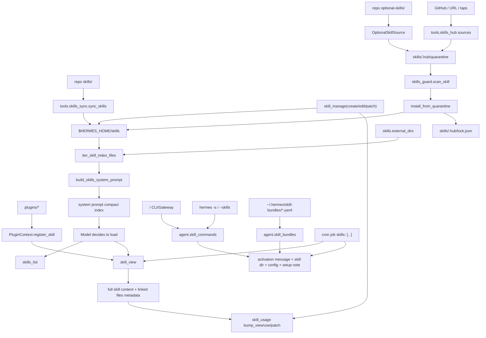

# Hermes Agent Skill System Architecture

本文档根据当前工作树代码整理 Hermes Agent 的 skill 系统。目标不是复述用户手册，而是给出一份可以据此重新实现同等机制的工程说明：数据模型、目录布局、发现与加载流程、prompt 注入方式、安装/同步策略、命令入口、安全边界、缓存、配置和测试要求。

结论先行：

- Hermes 的 skill 本质是“可发现、可按需加载的 Markdown 操作手册”，不是独立运行的插件，也不是权限沙箱。
- 运行时单一来源是 profile-scoped `$HERMES_HOME/skills/`；仓库内 `skills/` 只是 bundled skill 的种子源，会被同步复制到用户 profile。
- 系统 prompt 只注入 compact index：分类、名称、简短描述和强制加载规则；完整 `SKILL.md` 必须通过 `skill_view`、slash command、CLI 预加载、cron job 或 bundle 显式加载。
- skill 支持渐进披露：`skills_list` 返回元数据，`skill_view(name)` 返回主说明，`skill_view(name, file_path)` 返回 supporting file。
- skill 支持本地 skill、外部只读目录、hub-installed skill、bundled skill、agent-managed skill、plugin namespaced skill 和 skill bundle；这些来源共享一部分读取逻辑，但安装/状态/安全规则不同。
- 安全模型是“安装前扫描 + 加载路径限制 + cron assembled prompt 扫描 + 普通工具权限边界”，不是执行隔离。skill 中的脚本只有被模型通过终端工具实际运行时才执行。

## 1. Scope

本文档覆盖这些实现层：

1. Skill content format
   - 文件：任意 skill 目录下的 `SKILL.md`
   - 内容：YAML frontmatter + Markdown instruction body
   - supporting files：`references/`、`templates/`、`scripts/`、`assets/`

2. Runtime skill store
   - 本地目录：`$HERMES_HOME/skills/`
   - 外部目录：`skills.external_dirs`
   - bundled 同步 manifest：`$HERMES_HOME/skills/.bundled_manifest`
   - hub 状态：`$HERMES_HOME/skills/.hub/*`
   - 使用状态：`$HERMES_HOME/skills/.usage.json`

3. Discovery and prompt index
   - `agent/skill_utils.py`
   - `agent/prompt_builder.py`
   - `agent/system_prompt.py`
   - `tools/skills_tool.py`

4. Loading and invocation
   - `tools/skills_tool.py`
   - `agent/skill_commands.py`
   - `agent/skill_bundles.py`
   - `cli.py`
   - `gateway/run.py`
   - `cron/scheduler.py`

5. Mutation, sync, hub install, provenance
   - `tools/skill_manager_tool.py`
   - `tools/skills_sync.py`
   - `tools/skills_hub.py`
   - `hermes_cli/skills_hub.py`
   - `tools/skills_guard.py`
   - `tools/skill_usage.py`
   - `hermes_cli/plugins.py`

## 2. Component Map



## 3. Core Concepts

### 3.1 Skill

一个 skill 是一个目录，至少包含：

```text
<skill-dir>/
  SKILL.md
```

可选 supporting files：

```text
<skill-dir>/
  references/
  templates/
  scripts/
  assets/
```

`SKILL.md` 是唯一的索引文件。目录层级可用于分类：

```text
$HERMES_HOME/skills/
  software-development/
    test-driven-development/
      SKILL.md
  media/
    gif-search/
      SKILL.md
```

实现要求：

- 发现 skill 时递归查找 `SKILL.md`。
- 跳过 VCS、依赖、缓存、archive、hub metadata 等目录。
- category 来自 skill 目录相对 skills root 的父级路径。
- skill name 优先使用 frontmatter `name`，缺省回退到目录名。

### 3.2 Progressive Disclosure

Hermes 不把所有 skill 全量塞进 system prompt，而是三层披露：

| 层级 | 入口 | 内容 | 目的 |
| --- | --- | --- | --- |
| Index | `build_skills_system_prompt` | category、name、短 description | 低 token 成本地提醒模型有哪些 skill |
| Metadata list | `skills_list(category?)` | JSON: name、description、category、categories | 工具式检索和列表 |
| Full load | `skill_view(name, file_path?)` | `SKILL.md` 或 supporting file 内容 | 按需加载操作手册和资料 |

系统 prompt 的 skill index 必须显式要求模型在相关任务前调用 `skill_view(name)`。这不是搜索结果展示，而是行为约束。

### 3.3 Source Types

| 来源 | 存储 | 是否进入 prompt index | 是否可 `skill_view` | 是否由 hub lock 管理 | 是否可由 curator 自动归档 |
| --- | --- | --- | --- | --- | --- |
| bundled | 同步到 `$HERMES_HOME/skills` | 是 | 是 | 否，使用 `.bundled_manifest` | 否 |
| official optional | 安装后进 `$HERMES_HOME/skills` | 是 | 是 | 是 | 否 |
| hub remote | 安装后进 `$HERMES_HOME/skills` | 是 | 是 | 是 | 否 |
| user/agent local | `$HERMES_HOME/skills` | 是 | 是 | 否 | 只有后台 review 标记为 agent-created 后才可 |
| external dirs | `skills.external_dirs` 指向的只读目录 | 是 | 是 | 否 | 否 |
| plugin skill | 插件注册表，qualified name | 否 | 仅 `namespace:skill` | 否 | 否 |
| bundle | `$HERMES_HOME/skill-bundles/*.yaml` | 不作为 skill index | 通过 slash 组合加载 | 否 | 否 |

## 4. On-Disk Layout

### 4.1 Profile-Scoped Runtime Store

所有运行时 skill 默认在 active profile 的 Hermes home：

```text
$HERMES_HOME/
  skills/
    .bundled_manifest
    .usage.json
    .usage.json.lock
    .archive/
    .hub/
      lock.json
      taps.json
      audit.log
      quarantine/
      index-cache/
    <category>/
      <skill>/
        SKILL.md
```

实现要求：

- 不要把运行时修改直接写回仓库 `skills/`。
- 所有新建 skill 写入 `$HERMES_HOME/skills`。
- 使用 `get_hermes_home()` / `get_skills_dir()` 动态解析 profile，而不是硬编码 `~/.hermes`。
- profile 切换时，skill store 也切换。

### 4.2 Bundled Sync Manifest

Bundled skills 从仓库 `skills/` 同步到 `$HERMES_HOME/skills/`。同步状态文件：

```text
$HERMES_HOME/skills/.bundled_manifest
```

v2 行格式：

```text
<skill_name>:<origin_hash>
```

同步规则：

1. bundled source 中存在、manifest 中不存在：
   - 若目标路径不存在：复制，并记录当前 hash。
   - 若目标路径已存在且 hash 相同：只记录 manifest。
   - 若目标路径已存在但不同：保留用户版本，不记录为 bundled baseline。
2. manifest 中存在、目标路径存在：
   - 若用户 hash 等于 manifest origin hash，且 bundled hash 改变：安全更新。
   - 若用户 hash 不等于 origin hash：用户修改过，跳过。
3. manifest 中存在、目标路径不存在：认为用户删除过，尊重删除，不重建。
4. manifest 中存在、bundled source 已移除：清理 manifest entry。
5. category `DESCRIPTION.md` 可以复制到目标 category 下，但不覆盖已有文件。

这套规则是保护用户修改的核心，不应简化成“每次启动覆盖复制”。

### 4.3 Hub State

Hub 安装状态在：

```text
$HERMES_HOME/skills/.hub/
  lock.json
  taps.json
  audit.log
  quarantine/
  index-cache/
```

`lock.json` 结构：

```json
{
  "version": 1,
  "installed": {
    "skill-name": {
      "source": "github",
      "identifier": "owner/repo/path/to/skill",
      "trust_level": "trusted",
      "scan_verdict": "safe",
      "content_hash": "sha256:...",
      "install_path": "category/skill-name",
      "files": ["SKILL.md", "scripts/foo.py"],
      "metadata": {},
      "installed_at": "...",
      "updated_at": "..."
    }
  }
}
```

实现要求：

- `install_path` 必须只允许 `<skill>` 或 `<category>/<skill>`。
- uninstall 只能删除 lock 中记录的 hub-installed skill。
- uninstall 前必须重新验证 `install_path` 不为绝对路径、不含 traversal、不解析到 skills root、不经过 symlink/junction 跳转到 root 外。
- audit log 对 install、uninstall、blocked 等动作追加记录。

## 5. `SKILL.md` Format

### 5.1 Required Minimum

```markdown
---
name: my-skill
description: Brief description shown in skill search and prompt index
---

# My Skill

Use this skill when...

## Procedure

1. Do the first step.
2. Verify the result.
```

实现要求：

- `skill_manage(create/edit)` 必须要求 frontmatter 存在。
- frontmatter 必须是 YAML mapping。
- `name` 和 `description` 必填。
- `description` 长度限制为 1024 字符。
- `name` 长度限制为 64 字符。
- agent-created skill name 只能使用文件系统安全字符：小写字母、数字、`.`、`_`、`-`，且以字母或数字开头。

### 5.2 Supported Frontmatter

```yaml
---
name: my-skill
description: Brief description
version: 1.0.0
author: Someone
license: MIT
platforms: [macos, linux]

required_environment_variables:
  - name: TENOR_API_KEY
    prompt: Tenor API key
    help: Get a key from https://developers.google.com/tenor
    required_for: full functionality
    optional: false

setup:
  help: Optional setup help
  collect_secrets:
    - env_var: SERVICE_TOKEN
      prompt: Service token
      provider_url: https://example.com/tokens
      secret: true

prerequisites:
  env_vars: [LEGACY_API_KEY]
  commands: [curl, jq]

metadata:
  hermes:
    tags: [Category, Keyword]
    related_skills: [other-skill]
    fallback_for_toolsets: [web]
    requires_toolsets: [terminal]
    fallback_for_tools: [web_search]
    requires_tools: [terminal]
    config:
      - key: wiki.path
        description: Path to local wiki
        default: "~/wiki"
        prompt: Wiki directory path
---
```

字段语义：

| 字段 | 语义 |
| --- | --- |
| `name` | 逻辑 skill 名；prompt index、禁用配置、usage 记录使用它 |
| `description` | prompt index 和 list 输出中的短描述 |
| `platforms` | OS gating；支持 `macos`、`linux`、`windows`，Termux 兼容 linux |
| `required_environment_variables` | load-time 安全收集/提示元数据 |
| `setup.collect_secrets` | 旧式/补充 secret collection 语义，规范化到 required env vars |
| `prerequisites.env_vars` | legacy alias，规范化为 required env vars |
| `prerequisites.commands` | advisory only，不隐藏 skill |
| `metadata.hermes.tags` | 展示/搜索标签 |
| `metadata.hermes.related_skills` | 相关 skill 提示 |
| `metadata.hermes.fallback_for_*` | 当指定工具/工具集存在时隐藏该 fallback skill |
| `metadata.hermes.requires_*` | 当指定工具/工具集不存在时隐藏该 skill |
| `metadata.hermes.config` | skill 声明的 config.yaml 变量，slash 加载时注入 resolved values |

### 5.3 Supporting Files

支持目录：

```text
references/  Markdown reference docs
templates/   md/py/yaml/yml/json/tex/sh templates
scripts/     py/sh/bash/js/ts/rb scripts
assets/      supplementary files
```

读取规则：

- `skill_view(name)` 返回 `linked_files`，按 `references`、`templates`、`assets`、`scripts` 分组。
- `skill_view(name, file_path)` 可以读取 skill 目录内任意相对文件。
- `file_path` 禁止 `..` traversal。
- resolved path 必须仍在 skill directory 下。
- 二进制文件读取返回 `[Binary file: ...]` 说明，而不是原始 bytes。
- slash/preload 加载会把 supporting files 的相对路径和绝对路径列给模型，提示可用 `skill_view(..., file_path=...)` 或直接用绝对路径运行 scripts。

## 6. Discovery

### 6.1 Directory Iteration

统一遍历函数等价于：

```python
def iter_skill_index_files(skills_dir: Path, filename: str):
    matches = []
    for root, dirs, files in os.walk(skills_dir, followlinks=True):
        dirs[:] = [d for d in dirs if d not in EXCLUDED_SKILL_DIRS]
        if filename in files:
            matches.append(Path(root) / filename)
    for path in sorted(matches, key=lambda p: str(p.relative_to(skills_dir))):
        yield path
```

`EXCLUDED_SKILL_DIRS` 至少包括：

```text
.git, .github, .hub, .archive, .venv, venv, node_modules,
site-packages, __pycache__, .tox, .nox, .pytest_cache,
.mypy_cache, .ruff_cache
```

实现要求：

- 所有扫描路径必须共享同一排除列表。
- 需要跟随 symlink 以支持用户将 skill 目录链接进 `$HERMES_HOME/skills`，但安装/uninstall 的破坏性边界必须额外拒绝 symlink redirect。

### 6.2 External Dirs

配置：

```yaml
skills:
  external_dirs:
    - ~/my-skills
    - ${WORKSPACE}/skills
    - relative-to-hermes-home
```

解析规则：

1. 读取 `$HERMES_HOME/config.yaml`。
2. 展开 `~` 和 `${VAR}`。
3. 相对路径基于 `$HERMES_HOME`，不是当前工作目录。
4. 解析成绝对路径。
5. 忽略不存在目录、重复目录、等于本地 `$HERMES_HOME/skills` 的目录。
6. 按配置顺序追加到扫描列表；本地目录永远优先。
7. 按 config 文件 mtime 缓存解析结果。

### 6.3 Disabled Skills

配置：

```yaml
skills:
  disabled:
    - global-disabled-skill
  platform_disabled:
    telegram:
      - skill-disabled-on-telegram
    cli: []
```

解析规则：

- 若传入 platform，或环境中有 `HERMES_PLATFORM` / gateway session 中有 `HERMES_SESSION_PLATFORM`，优先读取 `skills.platform_disabled.<platform>`。
- 若 platform-specific list 存在，即使为空，也替代 global disabled list。
- 若不存在 platform-specific list，回退到 global disabled list。
- `skills_list`、prompt index、slash command scan、`skill_view` 都必须尊重 disabled skills。

### 6.4 Platform Gating

`platforms` frontmatter 规则：

- 缺失或空值：所有 OS 兼容。
- 字符串或数组都接受。
- `macos` 映射 `sys.platform.startswith("darwin")`。
- `linux` 映射 `sys.platform.startswith("linux")`。
- `windows` 映射 `sys.platform.startswith("win32")`。
- Termux 环境下 `linux`、`termux`、`android` 都视为兼容。

## 7. System Prompt Index

### 7.1 Injection Point

`agent/system_prompt.py` 只在 skills tools 可用时注入 skill index：

```python
has_skills_tools = any(
    name in agent.valid_tool_names
    for name in ["skills_list", "skill_view", "skill_manage"]
)
```

如果有，计算当前可用 toolsets：

```python
available_toolsets = {
    get_toolset_for_tool(tool_name)
    for tool_name in agent.valid_tool_names
}
```

然后调用：

```python
build_skills_system_prompt(
    available_tools=agent.valid_tool_names,
    available_toolsets=available_toolsets,
)
```

### 7.2 Output Shape

prompt index 形态：

```text
## Skills (mandatory)
Before replying, scan the skills below. If a skill matches...
...
<available_skills>
  category: optional category description
    - skill-name: short description
    - other-skill
</available_skills>

Only proceed without loading a skill if genuinely none are relevant to the task.
```

实现要求：

- 分类按名称排序。
- skill 在分类内按 name 排序。
- 去重：同一分类内重复 name 只显示一次。
- category description 来自 category 下 `DESCRIPTION.md` frontmatter `description`。
- local skill name 与 external skill name 冲突时，local 优先，external 跳过。
- prompt index 不包含 plugin skill；plugin skill 必须通过 `namespace:skill` 显式 `skill_view`。

### 7.3 Conditional Activation

`metadata.hermes` 下的条件字段：

```yaml
fallback_for_toolsets: [web]
requires_toolsets: [terminal]
fallback_for_tools: [web_search]
requires_tools: [terminal]
```

评估规则：

```python
def skill_should_show(conditions, available_tools, available_toolsets):
    if available_tools is None and available_toolsets is None:
        return True

    for ts in fallback_for_toolsets:
        if ts in available_toolsets:
            return False
    for t in fallback_for_tools:
        if t in available_tools:
            return False

    for ts in requires_toolsets:
        if ts not in available_toolsets:
            return False
    for t in requires_tools:
        if t not in available_tools:
            return False

    return True
```

### 7.4 Cache

prompt index 有两层缓存：

1. In-process LRU
   - key 包含：
     - resolved local skills dir
     - external dirs
     - sorted available tools
     - sorted available toolsets
     - platform hint
     - disabled skill names
   - 最大 8 项。

2. Disk snapshot
   - 文件：`$HERMES_HOME/.skills_prompt_snapshot.json`
   - 仅缓存本地 `$HERMES_HOME/skills` 的 parsed metadata。
   - snapshot version 固定检查。
   - manifest 是所有 `SKILL.md` 和 `DESCRIPTION.md` 的相对路径、mtime_ns、size。
   - manifest 不匹配时全量重扫并重写 snapshot。
   - external dirs 不写入 snapshot，直接扫描。

需要清 cache 的动作：

- `skill_manage` 成功 mutation 后清 in-process cache 和 disk snapshot。
- hub install 默认清 cache，使新 skill 立即进 prompt index。
- `/reload-skills` 只刷新 slash command map，不清 prompt cache，以保留 prompt prefix cache；它会给下一轮注入一次性 reload note。

## 8. Tool APIs

### 8.1 `skills_list(category=None, task_id=None)`

返回 JSON string。

成功结构：

```json
{
  "success": true,
  "skills": [
    {
      "name": "gif-search",
      "description": "Search GIFs...",
      "category": "media"
    }
  ],
  "categories": ["media"],
  "count": 1,
  "hint": "Use skill_view(name) to see full content, tags, and linked files"
}
```

行为：

- 若 `$HERMES_HOME/skills` 不存在，创建目录并返回空列表。
- 扫描本地目录和 external dirs。
- 默认跳过 disabled 和 incompatible skill。
- 按 `(category or "", name)` 排序。
- description 优先 frontmatter `description`；若缺失，从 body 第一条非标题非空行推断；最长 1024 字符。

### 8.2 `skill_view(name, file_path=None, task_id=None, preprocess=True)`

返回 JSON string。

主 skill 成功结构：

```json
{
  "success": true,
  "name": "gif-search",
  "content": "---\\nname: gif-search\\n... full SKILL.md ...",
  "description": "...",
  "tags": ["media"],
  "related_skills": ["other"],
  "linked_files": {
    "references": ["references/api.md"],
    "templates": ["templates/example.json"],
    "assets": ["assets/foo.png"],
    "scripts": ["scripts/fetch.py"]
  },
  "path": "media/gif-search/SKILL.md",
  "skill_dir": "/abs/path/to/skill",
  "readiness_status": "available",
  "setup_needed": false,
  "setup_note": null,
  "setup_skipped": false,
  "gateway_setup_hint": null
}
```

这是代表性结构。`setup_note`、`setup_help`、`gateway_setup_hint`、`metadata`、`compatibility` 等字段只在对应条件成立时出现。

specific file 成功结构：

```json
{
  "success": true,
  "name": "gif-search",
  "file": "references/api.md",
  "content": "...",
  "file_type": ".md"
}
```

错误结构统一包含：

```json
{
  "success": false,
  "error": "...",
  "hint": "..."
}
```

查找顺序：

1. 如果 `name` 含 `:`：
   - 解析为 `(namespace, bare)`。
   - namespace 必须匹配 `[a-zA-Z0-9_-]+`。
   - 尝试 plugin registry 中的 `namespace:bare`。
   - 若 plugin 存在但 bare 不存在，返回 `available_skills`。
   - 若 plugin 不存在，回退到本地 categorized path `namespace/bare`。
2. 本地/external 查找：
   - direct directory：`<root>/<name>/SKILL.md`
   - direct legacy file：`<root>/<name>.md`
   - categorized path：`<root>/<namespace>/<bare>/SKILL.md`
   - recursive by parent dir name：任意 `.../<name>/SKILL.md`
   - legacy flat `<name>.md` anywhere
3. 如果多个候选匹配，返回 ambiguous error，不猜测。

加载规则：

- 读取 `SKILL.md` 一次，解析 frontmatter。
- 若 platform 不兼容，返回 `readiness_status: unsupported`。
- 若 disabled，返回错误。
- 检查是否在 trusted skills dirs 内：本地 skills root + external dirs。外部不受信只记录 warning，不直接阻止。
- 检查常见 prompt injection 文本，只记录 warning，不直接阻止本地 skill 加载。
- 解析 tags / related skills：优先 `metadata.hermes.*`，回退 top-level。
- 如果 `preprocess=True`，应用 template vars 和 inline shell 预处理。

view/use telemetry：

- model-facing tool registry wrapper `_skill_view_with_bump` 在 `skill_view` 成功后 bump `view_count` 和 `use_count`。
- 直接 import 并调用 `skill_view()` 的内部路径不会自动经过 wrapper；如果该路径代表 active use，需要调用方自行 `bump_use`。cron、slash、preload、bundle 路径都显式记录 active use。
- usage sidecar 只对非 bundled、非 hub-installed skill 记录。

### 8.3 Readiness and Secret Setup

可选状态：

```python
class SkillReadinessStatus(str, Enum):
    AVAILABLE = "available"
    SETUP_NEEDED = "setup_needed"
    UNSUPPORTED = "unsupported"
```

required env vars 统一来源：

- `required_environment_variables`
- `setup.collect_secrets`
- legacy `prerequisites.env_vars`

每个 env var 规范化为：

```json
{
  "name": "TENOR_API_KEY",
  "prompt": "Tenor API key",
  "help": "Where to get it",
  "required_for": "full functionality",
  "optional": false
}
```

安全要求：

- env var name 必须匹配 `[A-Za-z_][A-Za-z0-9_]*`。
- 检查 `$HERMES_HOME/.env` 和当前 `os.environ`。
- gateway/messaging session 不做 in-band secret collection，只返回 setup hint。
- local CLI 可通过 registered secret capture callback 收集。
- 返回给模型的只有 setup 状态、缺失变量名、hint，不返回 secret value。

### 8.4 `skill_manage`

用途：让 agent 创建、修改、删除 skill。

动作：

```text
create      创建新 skill，写 SKILL.md
edit        完整替换 SKILL.md
patch       对 SKILL.md 或 supporting file 做 find-and-replace
delete      删除 skill
write_file  写 supporting file
remove_file 删除 supporting file
```

重要实现规则：

- 新建 skill 总是写入 `$HERMES_HOME/skills`。
- 修改/删除可作用于本地或 external dirs 中找到的 skill；但删除 pinned skill 被拒绝。
- `patch` 使用 fuzzy find-and-replace，并要求唯一匹配，除非 `replace_all=True`。
- `write_file` / `remove_file` 只允许 `references/`、`templates/`、`scripts/`、`assets/` 下的文件。
- supporting file 单文件限制 1 MiB，文本内容也受 100,000 字符限制。
- SKILL.md 内容限制 100,000 字符。
- 所有写入使用同目录临时文件 + atomic replace。
- 若 `skills.guard_agent_created` 为 true，写入后跑 security scan；危险则回滚。
- 成功 mutation 后清 skill prompt cache 和 snapshot。
- `delete(absorbed_into=...)` 用于声明 consolidation 或 pruning 意图；如果非空，目标 skill 必须存在。
- foreground `skill_manage(create)` 不标记为 curator-managed；只有 background review 创建的 skill 会 `mark_agent_created`。

## 9. Invocation Paths

### 9.1 Model-Initiated Loading

正常对话中，模型看到 system prompt 的 `<available_skills>` 后，应该调用：

```python
skill_view(name="some-skill")
```

返回内容作为 tool result 进入对话。模型随后按 SKILL.md 指令工作。

这种路径不会自动注入 skill directory/supporting files 的额外说明，除非 `skill_view` response 中已有 `linked_files`、`skill_dir` 等字段且模型使用它们。

### 9.2 Slash Command Loading

CLI 和 gateway 都支持：

```text
/<skill-slug> optional user instruction
```

流程：

1. `scan_skill_commands()` 扫描本地 skills + external dirs。
2. 对每个 skill：
   - platform compatible
   - not disabled
   - name 去重，本地优先
   - command slug = lower name，空格/下划线转 hyphen，删除非 `[a-z0-9-]`，压缩连续 hyphen
3. CLI/gateway 收到 slash command。
4. 先尝试 bundle，再尝试 skill。
5. `build_skill_invocation_message()` 调 `skill_view(..., preprocess=False)` 加载。
6. 构造一条用户消息，放入普通 agent message pipeline。

activation message 形态：

```text
[IMPORTANT: The user has invoked the "<skill_name>" skill, indicating they want
you to follow its instructions. The full skill content is loaded below.]

<skill content>

[Skill directory: /abs/path/to/skill]
Resolve any relative paths...

[Skill config (from ~/.hermes/config.yaml):
  wiki.path = /resolved/path
]

[This skill has supporting files:]
- references/api.md -> /abs/path/references/api.md
...

Load any of these with skill_view(name="<target>", file_path="<path>"), or run scripts directly...

The user has provided the following instruction alongside the skill invocation: ...
```

实现要求：

- slash command 加载应 bump use telemetry。
- gateway 每个平台还要再次检查 platform-specific disabled list，因为命令缓存是 process-global。
- Telegram 等平台可能把 hyphen 变 underscore；解析时 hyphen/underscore 等价。
- `/reload-skills` 只刷新 slash command cache，生成 added/removed diff。

### 9.3 CLI Preloaded Skills

CLI 支持启动参数预加载，例如 `--skills` / `-s`。

流程：

1. 解析 skill identifiers。
2. 调 `build_preloaded_skills_prompt(skill_identifiers, task_id=session_id)`。
3. 对每个 identifier 调 `_load_skill_payload`。
4. 构造 activation note：

```text
[IMPORTANT: The user launched this CLI session with the "<skill_name>" skill
preloaded. Treat its instructions as active guidance for the duration of this
session unless the user overrides them.]
```

5. 拼接到 session system prompt。
6. 任一预加载 skill 缺失，CLI 直接报 unknown skill。

### 9.4 Skill Bundles

Bundle 不是 skill，而是 slash command alias，加载多个 skill。

存储：

```text
$HERMES_HOME/skill-bundles/*.yaml
```

格式：

```yaml
name: backend-dev
description: Backend feature work
skills:
  - github-code-review
  - test-driven-development
instruction: |
  Optional bundle-level guidance.
```

规则：

- 文件 stem 是 fallback name。
- bundle command slug normalization 与 skill command 一致。
- 如果 bundle 和 skill command 冲突，bundle 优先。
- bundle 逐个加载 referenced skills；缺失 skill 被记录为 skipped，但不阻止已加载 skill 生效。
- bundle message header 必须列出 loaded 和 missing skills。
- cache 以 bundle dir 和文件 mtime 判断是否重扫。

### 9.5 Cron Skill Loading

cron job 支持：

```yaml
skill: legacy-one
skills:
  - skill-a
  - skill-b
```

流程：

1. 构造 cron execution guidance。
2. 注入 script output / context_from output。
3. 规范化 `skill` / `skills` 为 list。
4. 对每个 skill 调 `skill_view(skill_name)`。
5. 成功则注入 full content 和 activation note，bump use。
6. 缺失则把 skipped notice 插入 prompt 顶部，要求模型在回复开头告知用户。
7. 拼接用户 prompt。
8. 对 assembled prompt 做注入扫描。

cron 的特殊安全要求：

- 没有 skill 时用 strict cron prompt scanner。
- 有 skill 时用 looser assembled-skill scanner：只拦截明确 prompt injection / invisible unicode，避免误拦截安全文档中描述的命令。
- scanner 报错时，不运行 agent，返回 blocked doc。

### 9.6 Plugin Skills

插件可以注册只读 skill：

```python
ctx.register_skill("my-skill", Path(".../SKILL.md"), "description")
```

规则：

- 实际名称是 `<plugin_name>:<skill_name>`。
- skill name 不允许包含 `:`。
- namespace 和 skill name 均匹配 `[a-zA-Z0-9_-]+`。
- path 必须存在。
- plugin skill 不进入 `$HERMES_HOME/skills`。
- plugin skill 不进入 prompt index。
- `skill_view("plugin:skill")` 显式加载。
- 若 plugin disabled，加载返回错误。
- 加载时添加 bundle context banner，列出 sibling plugin skills，提示用 qualified form 调用。

## 10. Hub Install System

### 10.1 Source Adapters

统一接口：

```python
class SkillSource:
    def search(self, query: str, limit: int) -> list[SkillMeta]: ...
    def fetch(self, identifier: str) -> SkillBundle | None: ...
    def inspect(self, identifier: str) -> SkillMeta | None: ...
    def source_id(self) -> str: ...
    def trust_level_for(self, identifier: str) -> str: ...
```

数据模型：

```python
@dataclass
class SkillMeta:
    name: str
    description: str
    source: str
    identifier: str
    trust_level: str
    repo: str | None = None
    path: str | None = None
    tags: list[str] = []
    extra: dict = {}

@dataclass
class SkillBundle:
    name: str
    files: dict[str, str | bytes]
    source: str
    identifier: str
    trust_level: str
    metadata: dict = {}
```

默认 GitHub taps：

```text
openai/skills skills/
anthropics/skills skills/
huggingface/skills skills/
VoltAgent/awesome-agent-skills skills/
garrytan/gstack ""
MiniMax-AI/cli skill/
```

用户 taps 存储在 `.hub/taps.json`。

### 10.2 Install Flow

`hermes skills install <identifier>` 等价流程：

1. `ensure_hub_dirs()`
2. 建 source router。
3. 如果 identifier 没有 `/`，先搜索所有 source，用 exact name 解析；多重匹配要求用户给 full identifier。
4. `inspect` 获取 metadata，`fetch` 获取 bundle。
5. URL source 若缺少 valid name：
   - 有 `--name` 则使用。
   - interactive TTY 询问用户。
   - non-interactive 则拒绝并给命令示例。
6. official optional skill 自动从 identifier 推断 category。
7. 已安装且未 `--force` 时拒绝。
8. `quarantine_bundle(bundle)` 写入 `.hub/quarantine/<skill>`.
9. `skills_guard.scan_skill(q_path, source=...)`
10. `should_allow_install(scan_result, force=...)`
11. 非 `--force`、非 `skip_confirm` 时展示 third-party warning 或 official notice，要求用户确认。
12. `install_from_quarantine(...)`
13. 记录 lock、audit log。
14. 默认清 skill prompt cache；如果 caller 选择延迟生效，则提示下一 session 可用。

### 10.3 Path and URL Safety

实现要求：

- bundle-controlled path 全部用 POSIX 规则规范化。
- 禁止空路径、绝对路径、`..`、Windows drive prefix。
- skill name 不允许 nested path。
- category 不允许 nested path。
- bundle file path 允许 nested，但不允许 escape。
- URL fetch 必须过 SSRF 检查和 website policy 检查。
- redirect 每跳都重新检查 URL，最多 5 次。
- quarantine path 安装前必须确认在 quarantine root 下。
- install target 使用与 uninstall 相同的 lock-path validator。

### 10.4 Trust and Scan Policy

trusted repos：

```text
openai/skills
anthropics/skills
huggingface/skills
```

trust levels：

```text
builtin        repo-bundled / official optional
trusted        trusted repos
community      everything else
agent-created  local agent writes when guard enabled
```

policy：

| trust | safe | caution | dangerous |
| --- | --- | --- | --- |
| builtin | allow | allow | allow |
| trusted | allow | allow | block |
| community | allow | block | block |
| agent-created | allow | allow | ask/error |

`--force` 不能覆盖 trusted/community 的 dangerous verdict。

scanner 覆盖：

- exfiltration
- prompt injection
- destructive operations
- persistence
- network/reverse shell/tunnel
- obfuscation
- process execution
- path traversal
- crypto mining
- supply chain risky installs/fetches
- privilege escalation
- agent config persistence
- hardcoded secrets
- invisible unicode
- structural checks：文件数、总大小、单文件大小、binary/executable、symlink escape

## 11. Skill Config Injection

skill 可声明 config 变量：

```yaml
metadata:
  hermes:
    config:
      - key: wiki.path
        description: Path to wiki
        default: "~/wiki"
        prompt: Wiki directory path
```

存储位置：

```yaml
skills:
  config:
    wiki:
      path: /actual/path
```

slash/preload 加载时：

1. 从 raw skill content 解析 frontmatter。
2. 提取 `metadata.hermes.config`。
3. 从 config.yaml 的 `skills.config.<key>` 取值。
4. 若无值，使用 declared default。
5. 对字符串中的 `~` 和 `${VAR}` 展开。
6. 注入 activation message：

```text
[Skill config (from ~/.hermes/config.yaml):
  wiki.path = /actual/path
]
```

## 12. Preprocessing

`agent/skill_preprocessing.py` 支持两个功能，由 config 控制：

```yaml
skills:
  template_vars: true
  inline_shell: false
  inline_shell_timeout: 10
```

### 12.1 Template Vars

替换：

```text
${HERMES_SKILL_DIR}
${HERMES_SESSION_ID}
```

规则：

- 有具体值才替换。
- 无值时保留原 token，便于调试。

### 12.2 Inline Shell

语法：

```text
!`date +%Y-%m-%d`
```

规则：

- 默认关闭。
- 只匹配单行 backtick 内命令。
- 使用 `bash -c` 执行。
- cwd 为 skill directory。
- timeout 至少 1 秒。
- stdout 为空时可返回 stderr。
- 输出最多 4000 字符，超出截断。
- 失败不抛异常，返回 `[inline-shell error: ...]` 或 timeout marker。

## 13. Usage Telemetry and Curator

sidecar：

```text
$HERMES_HOME/skills/.usage.json
$HERMES_HOME/skills/.usage.json.lock
```

record：

```json
{
  "created_by": null,
  "use_count": 0,
  "view_count": 0,
  "last_used_at": null,
  "last_viewed_at": null,
  "patch_count": 0,
  "last_patched_at": null,
  "created_at": "2026-...",
  "state": "active",
  "pinned": false,
  "archived_at": null
}
```

规则：

- bundled skill 和 hub-installed skill 不写 usage sidecar。
- manually authored local skill 可有 telemetry，但不自动成为 curator-managed。
- 只有 `created_by == "agent"` 或 `agent_created == true` 的 record 才进入 curator 管理。
- `skill_view` bump view。
- slash/preload/bundle/cron active load bump use。
- `skill_manage(patch/edit/write_file/remove_file)` bump patch。
- delete 时 forget record。
- pinned 只阻止删除，不阻止 patch/edit。
- archive 将 skill 目录移动到 `$HERMES_HOME/skills/.archive/<skill>/`，restore 回到 flat top-level layout。

## 14. Security Boundaries

### 14.1 What Skill Security Does

- hub install 前扫描所有文件。
- bundle path / install path / uninstall path 做严格路径校验。
- `skill_view(file_path)` 防止 traversal。
- loading 时识别可疑 prompt injection 模式并记录 warning。
- cron assembled prompt 会在 agent 执行前重新扫描。
- gateway 不接受 in-band secret collection。
- secrets 只以状态/缺失名/hint 暴露给模型，不暴露值。

### 14.2 What Skill Security Does Not Do

- 不沙箱 `SKILL.md` 指令。
- 不自动执行或阻止 `scripts/` 中的脚本，除非模型通过 terminal 运行。
- 不保证 skill 指令不会影响模型行为；这正是 skill 的功能。
- 本地 `$HERMES_HOME/skills` 和 configured external dirs 被视为 trusted readable sources。
- `skill_view` 对本地 prompt injection pattern 是 warning，不是 block。

### 14.3 Required Path-Safety Invariants

实现必须保证：

- 不允许 `..` 作为 path component。
- 不允许 bundle/uninstall 使用绝对路径。
- 不允许 uninstall target resolve 到 `$HERMES_HOME/skills` 本身。
- uninstall 前逐组件检查 symlink/junction。
- supporting file 写操作只能进 allowed subdirs。
- path validator 必须在 destructive operation 前再跑一遍，不能信任 lock file。

## 15. UI and Command Integration

### 15.1 CLI

CLI 入口支持：

- `hermes skills` 进入 skills config UI。
- `hermes skills search/install/inspect/list/check/update/audit/uninstall/reset/publish/snapshot/tap`
- interactive slash:
  - `/<skill>`
  - `/<bundle>`
  - `/reload-skills`
  - `/bundles`
- startup preload：
  - `--skills`
  - `-s`

CLI 启动/更新时同步 bundled skills：

- 正常启动会调用 startup sync。
- update/install path 会调用 `sync_skills` 并打印 copied/updated/user-modified/cleaned。
- Termux 有 fingerprint stamp，避免每次启动昂贵 hash。

### 15.2 Gateway

gateway 启动时调用 `sync_skills(quiet=True)`。

gateway slash：

- plugin commands 优先于 skill。
- bundle 优先于 individual skill。
- skill command 支持 underscore/hyphen 互转。
- per-platform disabled 在 dispatch 时再检查。
- `/reload-skills` 运行在线程池，返回 added/removed，并向 session 存一条 pending reload note。

### 15.3 TUI / Web

TUI gateway 复用 `build_preloaded_skills_prompt`、`build_skill_invocation_message`、`reload_skills` 等共享函数。

Web UI 有 Skills page，但核心 skill 机制仍在 Python side；前端不应重新实现 discovery/source of truth。

## 16. Implementation Blueprint

如果要从零实现 Hermes 等价 skill 机制，建议按以下顺序做：

1. Path and profile foundation
   - 实现 `get_hermes_home()`、`get_skills_dir()`。
   - 所有路径 profile-scoped。
   - 定义 excluded dirs。

2. Frontmatter parser
   - 支持 YAML frontmatter。
   - 失败 fallback 到简单 `key: value` 或返回空 dict。
   - 提供 platform matching、disabled config、external dirs 解析。

3. Skill discovery
   - 递归查找 `SKILL.md`。
   - 实现 category extraction。
   - 实现 `skills_list`。
   - 实现 `skill_view` 主文件和 supporting file 读取。
   - 实现 name collision refusal。

4. Prompt index
   - 构建 compact category/name/description index。
   - 加入 mandatory load guidance。
   - 实现 conditional activation。
   - 加 in-process cache 和 disk snapshot。

5. Invocation wrappers
   - slash command scan。
   - slug normalization。
   - activation message builder。
   - skill directory/supporting files/config/setup note 注入。
   - CLI preload。
   - bundle YAML。

6. Mutation tool
   - create/edit/patch/delete/write_file/remove_file。
   - frontmatter validation。
   - atomic write。
   - size limits。
   - path safety。
   - cache invalidation。

7. Bundled sync
   - repo `skills/` 到 `$HERMES_HOME/skills`。
   - `.bundled_manifest` with origin hash。
   - user-modified skip。
   - reset bundled skill。

8. Hub install
   - source adapter abstraction。
   - quarantine。
   - scanner。
   - trust policy。
   - lock file。
   - uninstall path safety。
   - audit log。
   - taps。

9. Plugin skill registry
   - `register_skill(name, path, description)`。
   - qualified `namespace:skill` lookup。
   - disabled plugin handling。
   - sibling banner。

10. Runtime integrations
   - system prompt builder。
   - CLI/gateway slash dispatch。
   - cron assembled prompt loading/scanning。
   - usage telemetry。
   - setup secret callback / gateway hint。

## 17. Test Requirements

最低测试矩阵：

### Discovery

- 空 skills dir 返回空 list 并创建目录。
- nested category skill 被发现，category 正确。
- frontmatter name 优先于目录名。
- description 缺失时从 body 推断。
- excluded dirs 内的 `SKILL.md` 不注册。
- external dirs 生效、重复/不存在目录被跳过。
- local skill 与 external skill 同名时 local 优先。
- `skill_view` bare name 多重候选返回 ambiguous。

### Platform and Disabled

- `platforms: [macos]` 在非 macOS 隐藏。
- Termux 下 linux skill 兼容。
- global disabled 对 list/index/slash/view 生效。
- platform_disabled 覆盖 global disabled。
- gateway 多平台 session 不共用错误 disabled cache。

### Prompt Index

- category description 渲染。
- conditional activation fallback/requires 正确。
- cache key 包含 tools/toolsets/platform/disabled/external dirs。
- snapshot manifest 变更后失效。
- `/reload-skills` 不删除 snapshot。
- `skill_manage` / hub install 清 snapshot。

### `skill_view`

- direct path、recursive dir name、legacy `<name>.md` lookup。
- plugin `namespace:skill` lookup。
- invalid namespace 拒绝。
- plugin missing skill 返回 available list。
- plugin not found fallback 到 local `namespace/skill`。
- disabled plugin skill 拒绝。
- supporting file traversal 拒绝。
- binary file 返回 binary marker。
- setup metadata 缺失 env 时 readiness/setup note 正确。
- gateway surface 返回 setup hint，不收集 secret。

### Skill Manage

- create 要求 frontmatter name/description/body。
- invalid name/category 拒绝。
- duplicate skill 拒绝。
- patch 需要唯一匹配。
- patch SKILL.md 后仍校验 frontmatter。
- write_file 只允许 allowed subdirs。
- path traversal 拒绝。
- size limit 生效。
- pinned skill delete 拒绝，patch 允许。
- successful mutation 清 prompt cache。

### Bundled Sync

- new bundled copied and manifest recorded。
- unchanged skipped。
- bundled changed + user unchanged updates。
- user modified skill not overwritten。
- user-deleted manifest entry not re-copied。
- removed bundled skill cleaned from manifest。
- category DESCRIPTION.md copied without overwrite。
- reset bundled skill restore path works。

### Hub Install

- short name resolves exact one match。
- duplicate short name forces full identifier。
- URL no name interactive/non-interactive behavior。
- quarantine rejects unsafe bundle paths。
- scan policy blocks community caution/dangerous appropriately。
- `--force` cannot override dangerous trusted/community verdict。
- install writes lock and audit。
- uninstall rejects poisoned install_path。
- uninstall rejects symlink/junction escape。
- update check compares content hash including file paths。

### Invocation

- slash slug normalization handles spaces/underscore/hyphen/non-alnum。
- bundle wins over skill command.
- bundle loads multiple skills and reports missing.
- CLI preload appends prompt and rejects missing.
- cron loads multiple skills, skips missing, scans assembled prompt.
- gateway dispatch checks per-platform disabled at execution time.

## 18. Known Design Tradeoffs

- Prompt index 强制“相关就 load skill”，会增加 tool calls，但减少模型凭空猜命令。
- `skill_view` 对本地 prompt injection 只 warning，不 block；这是为了避免用户自己写的安全文档/红队资料被误杀。
- Bundled sync 不覆盖用户修改，牺牲“自动更新到最新”来保护用户定制。
- Plugin skills 不进 prompt index，牺牲自动发现来避免插件注册内容污染基础 prompt。
- External dirs 被视为 trusted readable source；如果要支持不可信 external dirs，需要引入 hub-style quarantine/scan/lock。
- Skill scripts 不是 tool。模型仍需通过 terminal 显式运行脚本，因此执行权限由普通工具权限系统决定。

## 19. Minimal Public API Summary

```python
# discovery / load
skills_list(category: str | None = None, task_id: str | None = None) -> str
skill_view(
    name: str,
    file_path: str | None = None,
    task_id: str | None = None,
    preprocess: bool = True,
) -> str

# mutation
skill_manage(
    action: Literal["create", "edit", "patch", "delete", "write_file", "remove_file"],
    name: str,
    content: str | None = None,
    category: str | None = None,
    file_path: str | None = None,
    file_content: str | None = None,
    old_string: str | None = None,
    new_string: str | None = None,
    replace_all: bool = False,
    absorbed_into: str | None = None,
) -> str

# prompt
build_skills_system_prompt(
    available_tools: set[str] | None = None,
    available_toolsets: set[str] | None = None,
) -> str
clear_skills_system_prompt_cache(clear_snapshot: bool = False) -> None

# slash / preload
scan_skill_commands() -> dict[str, dict]
get_skill_commands() -> dict[str, dict]
resolve_skill_command_key(command: str) -> str | None
build_skill_invocation_message(
    cmd_key: str,
    user_instruction: str = "",
    task_id: str | None = None,
    runtime_note: str = "",
) -> str | None
build_preloaded_skills_prompt(
    skill_identifiers: list[str],
    task_id: str | None = None,
) -> tuple[str, list[str], list[str]]

# bundles
get_skill_bundles() -> dict[str, dict]
resolve_bundle_command_key(command: str) -> str | None
build_bundle_invocation_message(
    cmd_key: str,
    user_instruction: str = "",
    task_id: str | None = None,
) -> tuple[str, list[str], list[str]] | None

# bundled sync
sync_skills(quiet: bool = False) -> dict
reset_bundled_skill(name: str, restore: bool = False) -> dict

# hub
quarantine_bundle(bundle: SkillBundle) -> Path
install_from_quarantine(...) -> Path
uninstall_skill(skill_name: str) -> tuple[bool, str]
check_for_skill_updates(name: str | None = None, ...) -> list[dict]
```

## 20. Source File Reference

主要实现文件：

| 文件 | 职责 |
| --- | --- |
| `agent/skill_utils.py` | frontmatter、platform、disabled、external dirs、conditions、config vars、iterator、namespace helpers |
| `agent/prompt_builder.py` | skill prompt index、cache、snapshot、conditional filtering |
| `agent/system_prompt.py` | system prompt 注入点 |
| `tools/skills_tool.py` | `skills_list`、`skill_view`、setup metadata、plugin dispatch、path safety |
| `agent/skill_commands.py` | slash/preload message construction、skill command scan/reload |
| `agent/skill_bundles.py` | bundle YAML、bundle slash loading |
| `tools/skill_manager_tool.py` | agent-facing skill CRUD |
| `tools/skills_sync.py` | bundled skill manifest sync |
| `tools/skills_hub.py` | hub source adapters、lock、quarantine、install/uninstall、taps |
| `hermes_cli/skills_hub.py` | CLI/slash command UX for hub |
| `tools/skills_guard.py` | external skill static scanner and trust policy |
| `tools/skill_usage.py` | usage telemetry、curator provenance、archive/restore |
| `hermes_cli/skills_config.py` | global/per-platform enable-disable UI |
| `hermes_cli/plugins.py` | plugin skill registration |
| `cli.py` | CLI slash/preload integration |
| `gateway/run.py` | gateway slash/reload/bundle integration |
| `cron/scheduler.py` | cron skill loading and assembled prompt scan |
