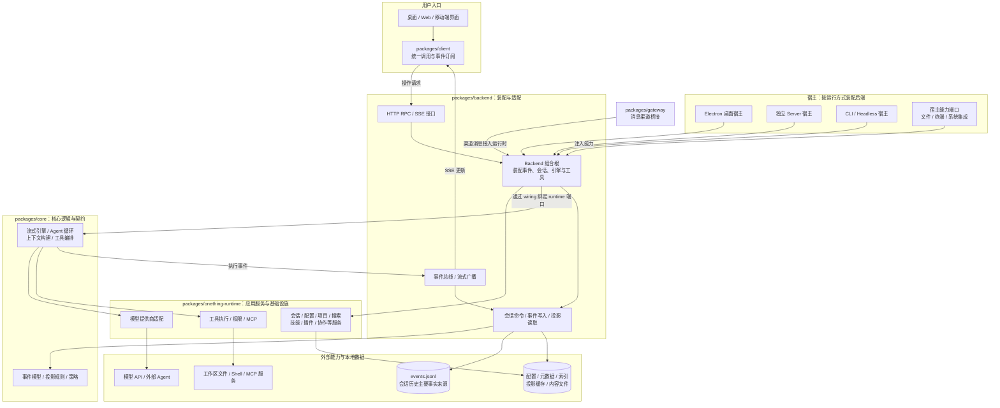
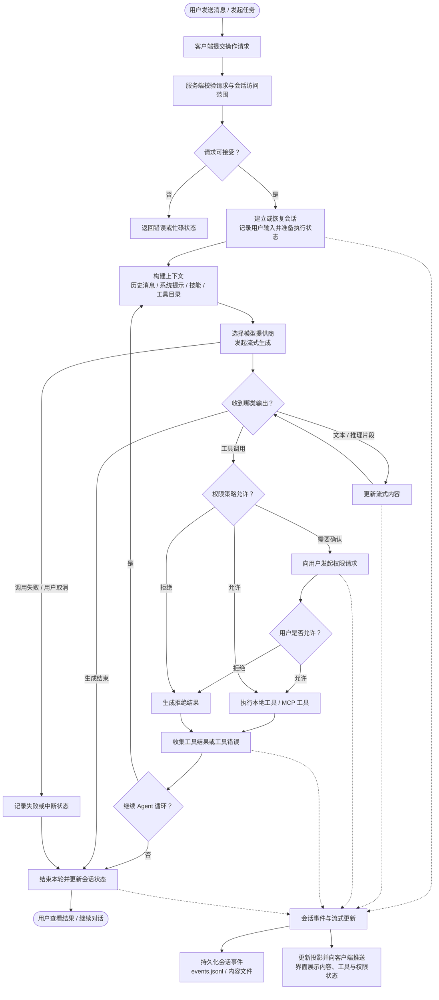

# 一事（onething）系统流程图与架构图

基于 2026-09-05 当前工作树整理。可编辑图表已通过 tldraw 界面绘制并保存至同目录的 `一事系统—流程图与架构图.tldraw`，包含“01 系统架构”和“02 任务流程”两页。本文保留更详细的 Mermaid 草稿与源码依据。

## 系统架构图

箭头表示主要调用或数据流；这是职责概览，不表示所有源码依赖都是单向分层。

宿主能力会影响可用功能。桌面内嵌 HTTP 服务复用已有后端；独立服务是另一种启动方式，不表示两者必须同时运行。部分桌面专有能力仍通过宿主适配或 IPC 提供。

## 一次任务的执行流程图

虚线表示执行过程中产生的旁路更新。持久化与界面广播在现有实现中存在不同通路；图中没有假定“每条更新都先持久化成功，再广播”。工具返回错误通常可作为结果交回模型，不一定直接结束整个任务。

## 核对依据

- `packages/backend/backend.ts`：后端装配、宿主能力、会话与引擎生命周期。
- `packages/backend/server/embed.ts`、`apps/server/src/main.ts`：桌面内嵌服务与独立服务入口。
- `packages/backend/server/runtime.ts`：RPC 运行时与后端服务适配。
- `packages/client/client.ts`：统一调用、事件订阅和能力查询。
- `packages/backend/wiring/engine/index.ts`：核心引擎与运行时绑定。
- `packages/core/engine/`：流式处理、Agent 循环、上下文与工具编排。
- `packages/backend/session/event-writer.ts`：会话事件写入与观察者通路。
- `docs/audit/backend-architecture-review-2026-09-04/README.md`：架构现状说明。
